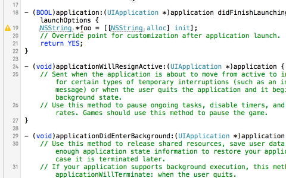
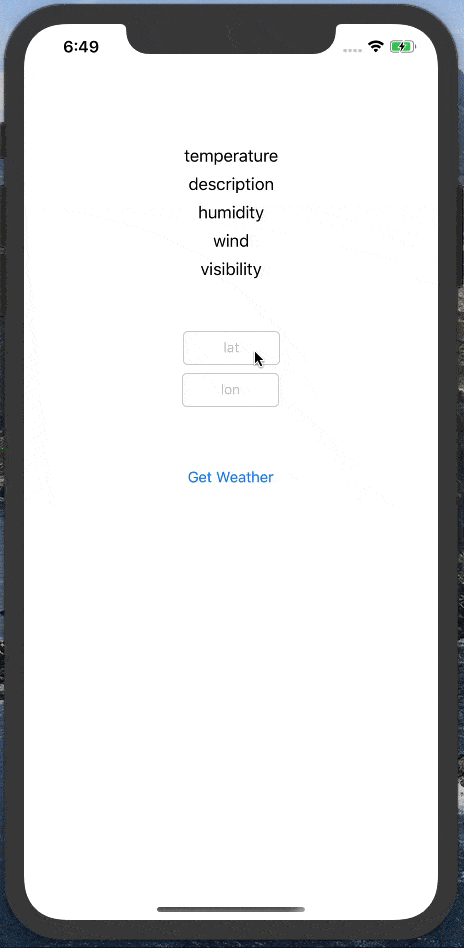
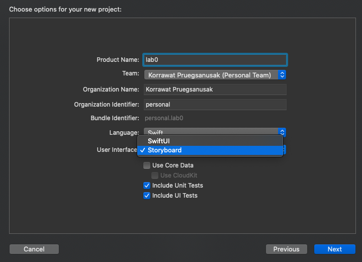

::: {#header_wrap .outer}
::: {#main_content .section .inner}
[6.808](../index.html) {#project_title}
======================

Lab 0 {#project_tagline}
-----

Assigned: 2020-02-03\
Due: 2020-02-10\
:::
:::

::: {#main_content_wrap .outer}
::: {#main_content .section .inner}
\[ [Xcode\'s Layout](#layout) \| [Xcode Shortcuts](#xcode-shortcuts) \|
[Xcode Docs](#xcode-docs) \| [Lab Assignment](#assignment) \]

In this lab, we cover the basics of the Xcode IDE, the iOS Simulator,
Xcode\'s Documentation Viewer, and the Swift programming language. By
the end of lab, we\'ll have built a simple iPhone application that
displays weather from the [Dark Sky](https://darksky.net/dev) API.

To complete this lab, you\'ll need to download
[Xcode](macappstores://itunes.apple.com/us/app/xcode/id497799835). If
you don\'t have a Mac of your own, you can use one of the Macs in the
56-129 athena cluster or pair up with a friend who has. Please make sure
to save your work in a proper directory, so that it won\'t be removed
after you log out.

------------------------------------------------------------------------

First, a little about Xcode\'s layout: {#layout}
--------------------------------------

 bottom: debugger (bottom left:variables, bottom right:console)")\
: Single (standard) editor, Assistant (split screen) editor, Version (git) editor | Toggle Nagivator, Toggle Debugger, Toggle Utilities")

------------------------------------------------------------------------

Some helpful Xcode shortcuts and tips {#xcode-shortcuts}
-------------------------------------

  --------------------- ------------------------------------
  View Documentation:   ⌥+Click
  Open Docs:            ⇧⌘[0]{style="font-family:Monaco;"}
  Go to Definition:     ⌘+Click
  Open file Quickly:    ⇧⌘O
  --------------------- ------------------------------------

⌘ = Command \| ⌥ = Option \| ⇧ = Shift

------------------------------------------------------------------------

Some helpful iOS Simulator shortcuts and tips {#sim-shortcuts}
---------------------------------------------

  ------------------------------------------------------------ -----
  Press Home Button:                                           ⇧⌘H
  Rotate Left                                                  ⌘←
  Rotate Right                                                 ⌘→
  If the keyboard isn\'t appearing/disappearing as expected:   ⌘K
  ------------------------------------------------------------ -----

⌘ = Command \| ⌥ = Option \| ⇧ = Shift

Xcode Documentation {#xcode-docs}
-------------------

Shortcut: ⇧⌘0

{alt="amazing"}

It\'s kind of amazing.

{alt="slow sloth stamping"}

It syncs locally, which takes a while

{alt="The Flash"}

But once it\'s downloaded, it\'s crazy fast.

{alt="house"}

It includes ready-to-build example projects for downloads.

{alt="option\_click"}

You can get to class documentation by option + clicking the class in
question.

Some info about Swift
---------------------

You may check [Apple\'s Swift
Tour](https://docs.swift.org/swift-book/GuidedTour/GuidedTour.html) or
[Apple\'s Swift
basics](https://docs.swift.org/swift-book/LanguageGuide/TheBasics.html)
for details.

On to your lab assignment! {#assignment}
--------------------------

{alt="picture of iOS Simulator loading weather
in a barebones app."}

You\'re building an app that basically loads the weather.

The fetchWeather is asynchronous. If there\'s no network, the app
shouldn\'t hang or crash.

We\'ve recorded videos with instructions on how to complete the lab in
Swift. (The videos have no sound.) The goal is to get you comfortable
with Xcode, the docs, the simulator, and Swift.

The videos build off of one another. You can do the assignment in your
own way, or in the exact way it\'s done in the videos. It\'s entirely up
to you.

The videos were recorded a few years ago, so some details about XCode\'s
user inferface and Swift have changed. Also, the recordings were based
on Wunderground API, which is no longer available. We suggest using the
[Dark Sky](https://darksky.net/dev) API to get current weather
conditions instead. However, the input is the latitude and longitude of
a location instead of a zip code. You can see an example JSON response
in [Dark Sky API
documentation](https://darksky.net/dev/docs#forecast-request). We have
noted changes for each video, if applicable, at the description before
the corresponding video.

#### Video 1 - Hello World

We create the project and print \"Hello World\". You\'ll also notice
that we resize the simulator, and click on some of the menu bars. This
just so that you see what those buttons do.

When creating a project, select \"Storyboard\" for \"User Inferface\".
Another option is \"SwiftUI\", which is actually a newer method but is
not compatible with the tutorial videos.

{width="640" alt="new project"}

------------------------------------------------------------------------

------------------------------------------------------------------------

#### Video 2 - Making a `Weather` Class

Here, we define a weather class with some properties and methods.

**Changes:** The function `fetchWeatherForZip` should take two arguments
(`lat: String, lon: String`) instead of just one (`zip: String`). You
may change the function name if you\'d like.

------------------------------------------------------------------------

------------------------------------------------------------------------

#### Video 3 - Flushing out the `Weather` Methods

We add some details to the weather methods from the previous video. In
the next video, we instantiate the weather class, and debug it. This
video contains an intentional error. We\'ll debug it in the next one.

**Changes:**

-   The url string is
    `"https://api.darksky.net/forecast/\(APP_ID)/\(lat),\(lon)"`.
-   An API key you can use is `c2e2b8d1e67810853bd729dc90f5c6ed`. If
    this key is not available, please sign up for free for a new key on
    the [Dark Sky API website](https://darksky.net/dev/register). (It
    should take less than 2 minutes.)

------------------------------------------------------------------------

------------------------------------------------------------------------

#### Video 4 - Instantiating and Debugging `Weather`

There was an error with weather. We illustrate some of the tools the
debugger has.

Using the debugger will make your life much, much easier, and we think
it\'s worth learning.

**Changes:** Take a look at an example JSON response in [Dark Sky API
documentation](https://darksky.net/dev/docs#forecast-request).

-   The correct key for JSON is `"currently"`, instead of
    `"current_observation"`.

-   What should be the key for current weather description?

-   For other values, the JSON response returns a number, not a string.
    We need to cast it into `Double` before using it in a meaningful
    string, e.g.

        self.windString = "Wind speed: \(currentObservations["windSpeed"] as! Double) mph"

    Can you find the correct key for each field (e.g. `"windSpeed"` for
    wind)?

------------------------------------------------------------------------

------------------------------------------------------------------------

#### Video 5 - Adding a button to the UX, defining constraints

We add a new button to the interface and define its constraints.

**We\'re pressing the control key while dragging from the button to the
`ViewController.swift` file.**

In new versions of XCode, the Library button (where you add UI elements
like Button and Label) is the plus sign button at the top right corner
instead. Also, you can show an Assistant editor by clicking Editor \>
Assistant or by using the following shortcut: ⌃⌥⌘↩︎.

------------------------------------------------------------------------

------------------------------------------------------------------------

#### Video 6 - Enabling the button

This is pretty straightforward. We\'re making the button actually do
stuff now.

Again remember to press the control key (⌃) while dragging!

------------------------------------------------------------------------

------------------------------------------------------------------------

#### Video 7 - Adding more UI Elements

We add some labels to display the weather. Note how we\'re using stack
view here.

There are at least 5 ways to lay out elements in Xcode. This is probably
the fastest.

Do not worry about the exact alignment of the elements too much, as long
as they show up on the simulators. If they don\'t, some constraints may
need to be changed or deleted (check the View Controller \> View \>
Constraints on the left).

**Changes:** Make two text fields for latitude and longtitude instead of
a single text field for zip code.

------------------------------------------------------------------------

------------------------------------------------------------------------

#### Video 8 - Making the UI Labels Update

We now update the UI Labels when results are fetched from the API.

Here are some examples of the approximate coordinates you can try:
Boston (42.4, -71.1), San Francisco (37.8, -122.4), Tokyo (35.7, 139.8).

------------------------------------------------------------------------

------------------------------------------------------------------------

#### Video 9 - UI Polish

This is about showing and hiding the keyboard. If the keyboard does not
show up, try pressing ⌘K (Hardware \> Keyboard \> Toggle Software
Keyboard) to see if the keyboard shows up.

**Changes:**

-   The keyboard type should be \"Numbers and Punctuation\" instead of
    \"Number Pad\" to allow for inputting a potentially negative number
    with a decimal point.
-   Call `resignFirstResponder` for both latitude and longitude text
    fields.

------------------------------------------------------------------------

------------------------------------------------------------------------

#### Video 10 - Blocks and Async

We update the app to work asynchronously. Mobile devices often have very
flaky connections, so it\'s important to know how to deal with them.

We don\'t have a video here. Instead, we put the code of two important
functions here. You may try them, or write your own.

\"Weather.swift\": `fetchWeatherForZip` function

    func fetchWeatherForZip(lat: String, lon: String, completionHandler: @escaping (Bool) -> Void) -> Void
    {
        NSLog("Getting conditions in %@ %@", lat, lon)
        let urlString: String = "https://api.darksky.net/forecast/\(APP_ID)/\(lat),\(lon)"

        let weatherURL = URL(string: urlString)

        let session = URLSession.shared
        let request = URLRequest(url: weatherURL!, cachePolicy: URLRequest.CachePolicy.useProtocolCachePolicy, timeoutInterval: 5.0)

        let task = session.dataTask(with: request, completionHandler: {(data, response, error) in
                let ret = self.parseData(data: data)
            DispatchQueue.main.async(execute: {()->Void in completionHandler(ret)})
        })

        task.resume()

    }

\"ViewController.swift\" `getWeather` function (Button Handler)

    @IBAction func getWeather(_ sender: UIButton) {

        NSLog("Get Weather")
        sender.isEnabled = false
        weather.fetchWeatherForZip(lat: lat.text!, lon: lon.text!, completionHandler: {(ret: Bool)->Void in
            if (ret)
            {
                NSLog("Succeeded")
                self.temperature.text = self.weather.currentTemp
                self.desc.text = self.weather.weatherDescription
                self.humidity.text = self.weather.relativeHumidity
                self.wind.text = self.weather.windString
                self.visibility.text = self.weather.visibilityKm
            } else {
                NSLog("Failed")
            }
            sender.isEnabled = true
        })

        lon.resignFirstResponder()
        lat.resignFirstResponder()
    }

------------------------------------------------------------------------

------------------------------------------------------------------------

That\'s it for now. Have a good one!

{alt="HACK THE
PLANET!"}

Check-offs {#checkoff}
----------

We will hold checkoffs during Office Hours (Thursday, February 6, 4-5pm
and Monday, February 10, 12-1pm) in the 56-129 Athena Cluster, and
during the iOS Tutorial on Friday, February 7, 4-5pm at 56-154 (the
usual classroom).
:::
:::
