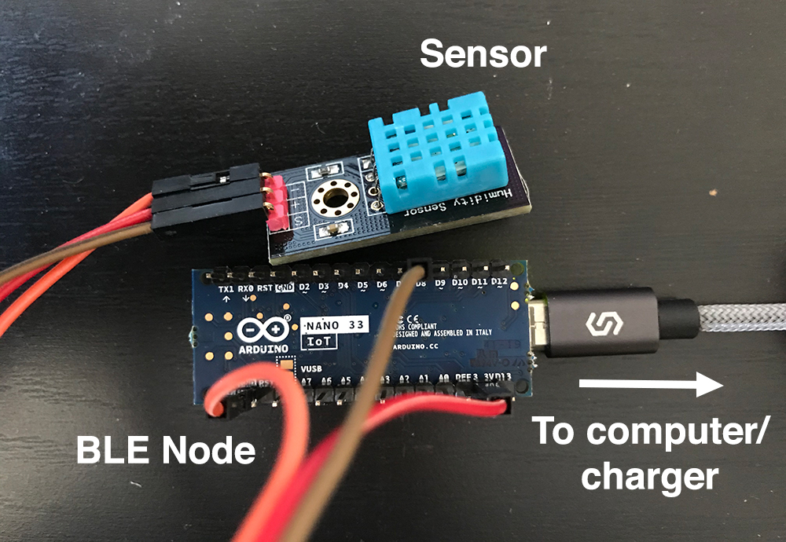
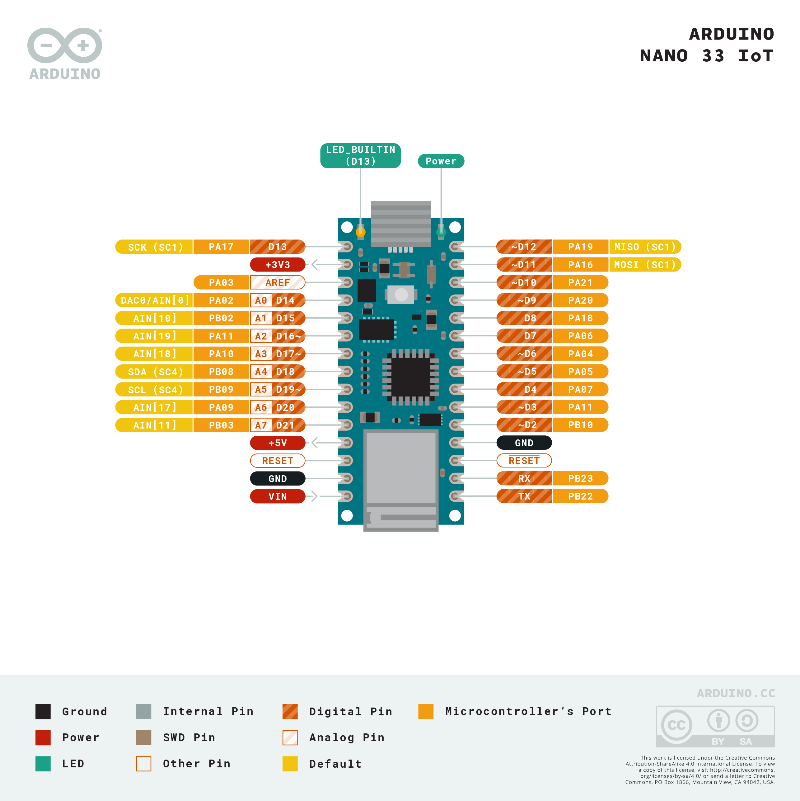

<div id="header_wrap" class="outer">
<header class="inner">

[6.808](../index.html) {#project_title}
===================

Lab 2: Getting Data From Anthills {#project_tagline}
---------------------------------

Assigned: 2019-02-25\
Due: 2019-03-13\

</header>
</div>

<div id="main_content_wrap" class="outer">
<div id="main_content" class="section inner">

- [Getting Started](#gettingstarted)
- [Section 1](#sec1)
    - [Task 1](#task01)
    - [Task 2](#task02)
    - [Task 3](#task03)
- [Section 2](#sec2)
    - [Task 4](#task04)
- [Completing the Lab](#completing)

The goal of this lab is to implement code in the Anteater app to scan
for a nearby Anthill, connect to it, and stream temperature and humidity
readings from it. We have provided you with all of the code to show
sensor readings in a table in the UI, and to plot sensor readings on a
chart, but you will need to implement all of the networking code, and
the code to extract sensor readings from packets sent by the Anthill.

Getting Started {#gettingstarted}
---------------

The Anteater code we provided for [lab 1](lab1.html) included a skeleton
class, `SensorModel.swift` that you will need to implement. The
`SensorModel` class will implement `BLEDelegate` and initialize an
instance of `BLE` to handle interaction with the device. In addition, to
convey the status of a sensor connection, `SensorModel` will make calls
into a delegate, which implements the `SensorModelDelegate` protocol
defined in `SensorModel.swift`. The methods of the delegate are as
follows:

``` {.swift .hljs}
func sensorModel(_ model: SensorModel, didChangeActiveHill hill: Hill?)
func sensorModel(_ model: SensorModel, didReceiveReadings readings: [Reading], forHill hill: Hill?)
```

These methods let the application know when a new sensor connects, or
when some data is received.

The code you downloaded for [lab 1](lab1.html) also includes a complete
implementation of the class `HillsTableViewController`, which creates an
instance of `SensorModel` and sets itself as the delegate of that
instance.

For **iOS 13**, please make the following changes:

- Select your project from the navigator panel and then highlight the
  Build Settings tab. Filter the settings or locate "Other Linker Flags"
  from this list and then add "-ObjC -all_load" to these settings. (See
  [this screenshot](images/lab2/build_settings_linker_flags.png) for
  reference.)
- Select "Info.plist" from the navigator panel and add a property
  "Privacy - Bluetooth Always Usage Description" with value "Bluetooth
  required".

This lab is divided into two sections. In the first section, you will
implement the code to scan for and connect to an anthill, and then in
the second section you will implement the code to extract readings from
packets sent by the anthill and deliver them to the app.

To test this lab, you will need to obtain an anthill node. Note that
the bluetooth functions you will implement do not work properly on the
iPhone simulator, so you will need to test on a real device. If you are
working with a partner, please check out only one anthill as we have a
limited number of them. Please do not throw the box away.

The anthill you receive will have a sensor and a USB Micro port. To
power the anthill, it will need to be powered over USB to your laptop,
or to any other USB charger, as shown below:

<center>
{width="450"}
</center>

The pins between the BLE node and sensor should be connected as follows:

-   **(+)** on sensor to **+3V3** on BLE node
-   **(-)** on sensor to **GND** on BLE node
-   **S** or **out** on sensor to **D8** on BLE node

There are two **GND** pins in total. If one does not work, try using
other pins.

<center>
[{width="600"}](https://store.arduino.cc/usa/nano-33-iot)
</center>

Section 1: Connecting to an Anthill {#sec1}
-----------------------------------

The goal of this section is to successfully establish a connection with
an anthill. In the next section you will extract data from packets sent
by the anthill.

Before working on this section, you should familiarize yourself with the
basics of Bluetooth Low Energy (BLE) and the iOS APIs for accessing it.
This [Apple
Document](https://developer.apple.com/library/ios/documentation/NetworkingInternetWeb/Conceptual/CoreBluetooth_concepts/CoreBluetoothOverview/CoreBluetoothOverview.html#//apple_ref/doc/uid/TP40013257-CH2-SW1)
does a good job of summarizing these.

Each anthill acts as a BLE Peripheral. The connection protocol is not
that complicated, but the code is somewhat messy as each step in the
protocol is asynchronous; that is, you make a call to perform some BLE
function, and some time later a callback is triggered in your
application to indicate that the function has completed.

The basic sequence is as follows:

1.  Start scanning for anthills
2.  Once an anthill is discovered, connect to it
3.  Once you have connected, discover its services
4.  For each service, discover its characteristics
5.  For each characteristic, check if it is the sensor data
    characteristic; if it is, start listening for notifications to the
    state of the characteristic
6.  On each state update, process the received data to extract any
    sensor readings.

<!-- Since each state update is at most 20 bytes, the anthill may fragment -->
<!-- one sensor reading across several packets. -->

You will need to add several functions to SensorModel in order to
implement BLEDelegate:

    func ble(didUpdateState state: BLEState)
    func ble(didDiscoverPeripheral peripheral: CBPeripheral)
    func ble(didConnectToPeripheral peripheral: CBPeripheral)
    func ble(didDisconnectFromPeripheral peripheral: CBPeripheral)
    func ble(_ peripheral: CBPeripheral, didReceiveData data: Data?)

The SensorModel should inherit from BLEDelegate:

    class SensorModel: BLEDelegate {
        // ...
    }

Once you add the `BLEDelegate` part to indicate that, Xcode will suggest
you to add protocol stubs. Press "Fix" in the red error box to add the
five function signatures automatically, or you can add them manually
too.

### Task 1: Initialize Bluetooth, and Start Scanning for Anthills {#task01}

Before you can scan for an anthill, you need to initialize a `BLE`
object. A good place to do this is in the `init` method of
`SensorModel`. Since you will need access this object repeatedly, you
probably want to store it in an instance variable of the class.

Keep in mind that after initializing the object, you will need to set
its delegate to the current SensorModel object:

    ble.delegate = self

Once you have created this object, the BLE will call
`ble(didUpdateState ...)` to indicate the status of Bluetooth. You
should check that the status is `BLEState.poweredOn` and if it is,
initiate scanning for anthills.

To initiate scanning, call the `startScanning` method on the `BLE`
instance.

Once scanning has started, you will receive a callback to the
`BLEDelegate` method `ble(didDiscoverPeripheral ...)`. You will need to
define this method in `SensorModel`, as per the signature in the
BLEDelegate protocol defined in `BLE.swift`.

To verify that this task is completed, use the debugger to confirm
`didUpdateState` is called and that the status is `BLEState.poweredOn`.
Also verify that when `startScanning` is called in the presence of an
anthill, you receive a callback to `didDiscoverPeripheral`.

### Task 2: Implement `didDiscoverPeripheral` {#task02}

`didDiscoverPeripheral` will be called when a BLE Peripheral advertising
the above characteristic comes into proximity of your phone. When this
happens, you need to connect to device, and then scan for services and
characteristics.

When `didDiscoverPeripheral` is called, you are given a handle to a
`CBPeripheral` object. This is the peripheral you want to try to connect
to (in this lab, you are going to connect to the first peripheral you
discover, and stay connected to it until it moves out of range, rather
than trying to prioritize connecting to certain anthills).

To connect to a peripheral, simply call `connectToPeripheral`. If the
connection is successful, `didConnectToPeripheral` will be called. You
will need to define `didConnectToPeripheral`, as per the signature in
`BLE.swift`. Use the debugger to verify that this method is called
correctly.

### Task 3: Implement `didConnectToPeripheral` {#task03}

Once you have connected to a peripheral, you will need to call the
delegate method `didChangeActiveHill`. The method takes an instance of
Hill, which is defined towards the top of `SensorModel.swift` (the name
of the Hill should be set to `peripheral.name`). You should initialize a
Hill and store it in the activeHill instance variable, as the delegate
will expect the same Hill later for the `didReceiveReadings` delegate
method. You will also need to store the CBPeripheral in an instance
variable, as you will want to distinguish the peripheral corresponding
to activeHill from other peripherals.

After connecting to a peripheral, the `BLE` instance will call the
`discoverServices` function in the iOS BLE API; then, after services are
discovered, the `BLE` instance will call
`didDiscoverCharacteristicsForService` and handle updates to the sensor
data characteristic. Finally, the `BLE` instance will request
notifications for the sensor characteristic, and the iOS API will call
`didUpdateValueForCharacteristic` on the `BLE` instance whenever a new
packet of sensor data is available. The `BLE` instance will then call
`didReceiveData` on the `SensorModel`.

To complete this task, verify that `didReceiveData` is being called,
e.g., by setting breakpoints in this method in the debugger. If it is
not called after about 30 seconds, see
[Troubleshooting](#troubleshooting).

Note that you will also need to implement `didDisconnectFromPeripheral`.
If the provided peripheral matches the one corresponding to the
activeHill, then you should call didChangeActiveHill with nil, so that
the delegate is notified that there is no longer any connected hill.

Section 2: Extracting readings from an Anthill {#sec2}
----------------------------------------------

When a connection is established, the Anthill begins streaming packets
containing sensor data on the sensor data characteristic. You will need
to extract sensor readings from this characteristic and post them to the
application. (For the purposes of this lab, you do not explicitly
request any data or send any commands to the anthill.)

<!-- The anthill sends a stream of ASCII characters, containing one of three -->
<!-- types of messages: humidity readings, temperature readings, and error -->
<!-- messages. Each message begins with a single letter, and then has a -->
<!-- custom payload. The messages are as follows: -->

The anthill sends a stream of ASCII characters, containing one of two
types of messages: humidity readings and temperature readings.
Each message begins with a single letter, and then has a
custom payload. The messages are as follows:

-   'H': humidity. The payload consists of an ASCII representation of
    the percent relatively humidity, as a floating point number,
    followed by a 'D', indicating the end of the number.
-   'T': temperature. The payload consists of an ASCII representation of
    the temperature (in Fahrenheit), as a floating point number,
    followed by a 'D', indicating the end of the number.
<!-- -   'E': an error, followed by an additional character indicating the -->
<!--     type of the error. (You can simply ignore error messages, but will -->
<!--     need to parse these messages.) If the Anthill continually sends -->
<!--     error packets, the connections betweeen the sensor and the board may -->
<!--     be loose. Check the connections, try connecting to a different -->
<!--     **GND** pin (there are three in total), or ask a TA for a new -->
<!--     Anthill/sensor. -->

<!-- This stream of messages is fragmented into BLE packets that are up to 20 -->
<!-- bytes in length. Note that this means that a given message may be spread -->
<!-- across two BLE packets. You will receive one call to `didReceiveData` -->
<!-- for each packet, but will not necessarily be able to parse the entirety -->
<!-- of each packet and will need to save the unparsed bytes in a buffer -->
<!-- until additional bytes arrive. You might also start receiving data from -->
<!-- the middle of a packet. -->

Each call to `didReceiveData` should correspond to one BLE packet
(humidity or temperature). Every two seconds, each anthill attempts read
the humidity and temperature values from the sensor and send a pair of
packets. However, because of loose connections or imperfect sensor, the
packets may not be sent every two seconds.

### Task 4: Implement `didReceiveData` {#task04}

To complete this task, implement code to extract messages from the
stream of packets delivered to `didReceiveData`.

Once you have extracted a sensor reading from the stream, create a
`Reading` object from it (set type to either ReadingType.Temperature or
ReadingType.Humidity, and sensorId to `peripheral.name`) and call the
delegate method `didReceiveReadings`. You should also add it to the
activeHill's `readings` array, which the UI will access to update its
list of sensor readings.

You might find these code snippets useful:

    // convert a non-nil Data optional into a String
    let str = String(data: data!, encoding: String.Encoding.ascii)!

    // convert a String to a Double
    let val = NSString(string: str).doubleValue

This task is complete when you can see sensor readings streaming into
sensor reading display on the Anteater Readings screen, as shown below:

<center>
{width="300px"}
</center>

#### Troubleshooting {#troubleshooting}

While it is unlikely to happen, if you suspect that no packets are being
sent despite correct sensor connections, you can debug it by following
the instructions below.

- Connect the Arduino board to your computer
- Install the [Arduino IDE](https://www.arduino.cc/en/Main/Software)
- Go to Tools > Board > select "Arduino NANO 33 IoT"
- Go to Tools > Port > select an option that ends with "(Arduino NANO 33
  IoT)"
- Go to Tools > Serial Monitor

You should see a window that prints "HELLO WORLD" every two seconds and
the temperature and humidity value pairs every time the packets are sent
([reference](images/lab2/serial_monitor.png)). If your iPhone app fails
to detect any packet after implementing it in Xcode and the Serial
Monitor does not show the messages as described, please contact us to
get a new board and sensor.

Completing the Lab {#completing}
------------------

A TA will checkoff your lab assignment. A checkoff will require
successfully displaying sensor readings on the Readings screen, as well
as disconnected and reconnected from a an anthill (by powering it down
and powering it back up.)

We will hold checkoffs during office hours. Submission instructions are
TBA. You will return the device at the checkoff.

</div>
</div>
