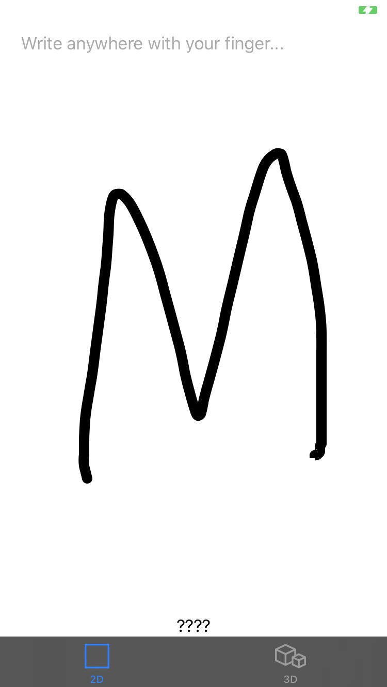
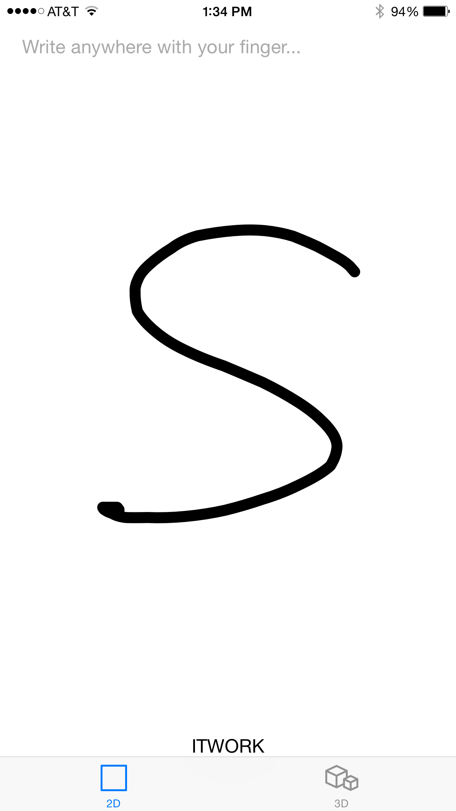
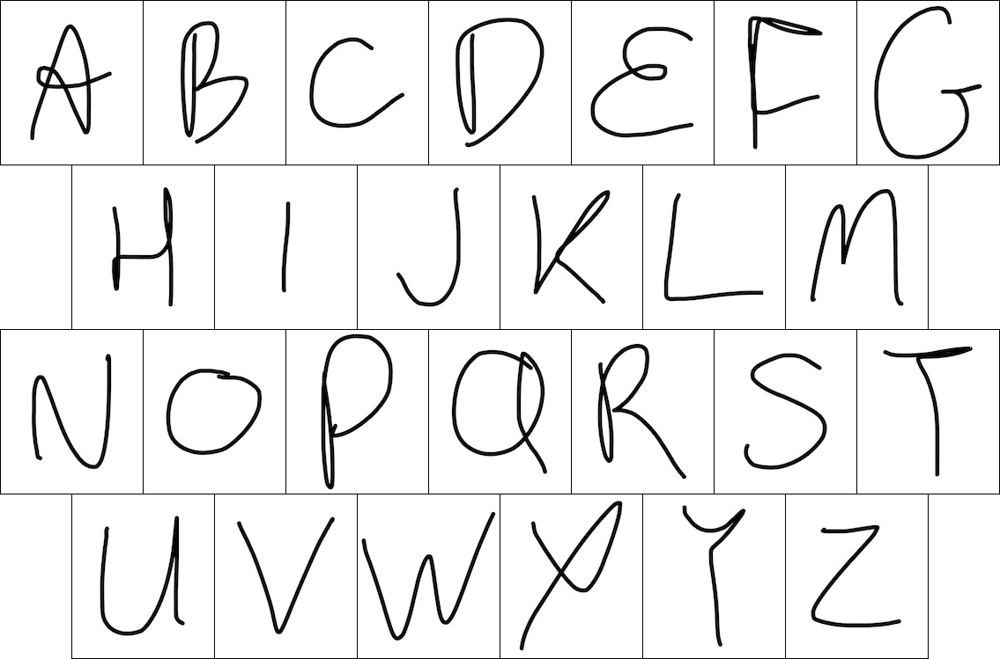

::: {#header_wrap .outer}
::: {#main_content .section .inner}
[6.808](index.html) {#project_title}
===================

Lab 3: Gesture Recognition and Inertial Sensing {#project_tagline}
-----------------------------------------------

Assigned: 2020-02-26\
Due: 2020-03-18\
:::
:::

::: {#main_content_wrap .outer}
::: {#main_content .section .inner}
-   [Overview](#overview)
-   [Section 1 --- Handwriting](#sec1)
    -   [Task 1A --- Rescaling](#task1a)
    -   [Task 1B --- Feature Extraction](#task1b)
    -   [Task 1C --- Data Collection](#task1c)
    -   [Task 1D --- Training](#task1d)
    -   [Task 1E --- Matching](#task1e)
    -   [Task 1F --- Optional Improvements](#task1f)
-   [Section 2 --- Inertial Measurement](#sec2)
    -   [Background](#motionBackground)
    -   [Rotations and Orientations](#rotations)
    -   [Responsibilities of `accumulateMotion:`](#backtoyou)
    -   [Task 2A --- Coordinate Transformation](#task2a)
    -   [Task 2B --- Integration](#task2b)
    -   [Task 2C --- Stabilization](#task2c)
    -   [Task 2D --- Optional Improvements](#task2d)
-   [Section 3 --- Mapping 3-D Gestures to 2-D](#sec3)
    -   [Task 3A --- Estimate Axes](#task3a)
    -   [Task 3B --- Project Coordinates](#task3b)
    -   [Task 3C --- Optional Improvements](#task3c)
-   [Appendix: Functions](#appendix)
-   [Submission and Checkoff](#submission)

Overview
--------

In this lab, you will

-   Build a working gesture/handwriting recognition system using machine
    learning
-   Work with data from the accelerometer, gyroscope, and compass
-   Become Kings of Kernels and Queens of Quaternions

As with most machine learning systems, the classifiers used in this lab
are not perfect, and may exhibit frustrating behaviors. Persistence and
creative problem solving (a.k.a. hacking up something that generally
works) are encouraged. If you would like to brainstorm about any
problems you encounter, we\'d be happy to talk.

The lab will consist of three sections. First, you will implement a
shape recognition algorithm using two-dimensional handwriting on the
touch screen as the data source. Next, you will develop 3-D motion
tracking code using the iPhone\'s sensors, and gain familiarity with the
capabilities and limitations of these sensors by playing with the
resulting app. Finally, you will feed data from your three-dimensional
motion tracker into the gesture recognition system of the first section.
At each point, you will be welcome to expand the capabilities of the
basic recognition framework we have put in your hands.

Please go ahead and download the [Xcode
project](codes/lab3/lab3-swift-blank.zip) for this lab. Update the team
and bundle identifier and build the app on an iPhone (not a simulator).
You should see two modes: 2D and 3D. In the 2D mode, you should be able
to write a letter on the screen and the app will show "?" for each
letter. In the 3D mode, try pressing and holding anywhere on the screen
while moving your phone around. There should be a "ribbon" at the center
of the screen and also a "?" sign for each gesture. If the starter code
does not work as described, please let us know.

<center>
{height="400"}
{height="400"}
</center>

Section 1 --- Handwriting {#sec1}
-------------------------

For this section, you will work through the details of implementing a
handwriting recognition system for letters drawn with a finger on an
iPhone screen. Here\'s how this will work.

You will be implementing `GestureProcessor`, a class encapsulating the
logic for interpreting sequences of points. In particular, you will fill
in all of the interesting parts of this method in
`GestureProcessor.swift`, which you can find under
`InertialMotion/Gesture Recognition` in Xcode\'s project navigator:

``` {#processGesture2D}
func processGesture2D(samples: [Sample2D], minSize: Double) {
        // -- TASK 1A --
        let count = samples.count
        var size: Double
        var clippedSize: Double
        var rescaledSamples: [Sample2D] = []
        var minX = Double.infinity
        var maxX = -Double.infinity
        var minY = Double.infinity
        var maxY = -Double.infinity
        // Compute size, clippedSize
        // Rescale points to lie in [0,1] x [0,1]

        // -- TASK 1B --
        var features: [Double] = [Double](repeatElement(0.0, count: N_FEATURES))
        // Classify each point according to which zone of a 3x3 Tic-Tac-Toe board it would fall in
        // Compute the time spent in each zone and the distance traveled horizontally and vertically

        // -- TASK 1C --
        #if TRAINING
            // Note Swift doesn't support #define. To run this section, set a compiler flag (i.e. "-D TRAINING" under Other Swift Flags)
            // Use this code if you want to do additional training
            // Log feature vector (with empty string for label) for training
            // Make sure to fill in the empty label when you copy the output into training.py

            var s = "('', ["
            for i in 0..<N_FEATURES {
                s += String(format: "%+.5f, ", features[i])
            }
            s.replaceSubrange(s.index(s.endIndex, offsetBy: -2)..<s.endIndex, with: "")
            s.append(", 1.0]),\n")

            let appDelegate = UIApplication.shared.delegate as! AppDelegate
            appDelegate.appendTrainingLog(entry: s)
        #endif
        // -- TASK 1D --
        // The output of the training procedure goes at the top of GestureProcessor.swift.

        // -- TASK 1E --
        var best_label = N_LABELS
        var best_score = -Double.infinity
        // Dot product with gesture templates in weights: [[Double]]

        #if !TRAINING
            // Report strongest match
            print(String(format: "Matched '%@' (score %+.5f)", labels[best_label], best_score))
        #endif
        delegate?.gestureProcessor(self, didRecognizeGesture: labels[best_label])
    }

```

This method will be called for you by the view controller when the user
has traced a stroke on the screen and then lifted their finger. Each
sample will consist of x and y coordinates for a touch event reported by
iOS, along with the absolute time in seconds when it occurred. You
don\'t need to know how the UI works for this lab, but you may find it
useful later to familiarize yourself with how the
`Gesture2DViewController` captures multi-touch events via the
[`UIResponder`](https://developer.apple.com/documentation/uikit/uiresponder)
[mechanism](https://developer.apple.com/documentation/uikit/touches_presses_and_gestures/using_responders_and_the_responder_chain_to_handle_events)
and the `func updateTouches(_ event: UIEvent?)` methods.

::: {.aside}
###### Aside:

The touch interface on iOS updates at (typically) 60 times per second,
except on very recent iPads, which are faster. If a user is scribing
letters fluidly and quickly, this is enough to resolve the shape of the
letters, but not to resolve the nuances of a quick stroke of the pen. If
we connect-the-dots together on the screen with straight lines, we will
not get a nice curve, but instead a jagged mess. For this app, we\'ve
implemented a very simple smoothing technique using quadratic Bezier
curves (look \'em up, they\'re fantastic) to make our results more
aesthetically pleasing. Keep an eye out, the next time you write your
signature on a touch-screen, whether the system samples fast enough to
resolve quick strokes, or whether you see a series of straight line
segments (called a polyline).
:::

Your ultimate goal in
`func processGesture2D(samples: [Sample2D], minSize: Double)` will be to
call the gesture processor\'s delegate\'s `gestureProcessor` method,
i.e.
`delegate?.gestureProcessor(self, didRecognizeGesture: labels[best_label])`.
The second argument is a string identifying the recognized gesture ---
for instance, a letter of the alphabet.

::: {.aside}
###### Aside:

This pattern, of passing `self` to a delegate method declared in a
protocol, is common in iOS, and is used because one instance of class B
might serve as the delegate to multiple instances of class A, and needs
to be able to tell which instance of A each delegate callback has come
from.
:::

### Task 1A --- Rescaling {#task1a}

Your first task in
[`func processGesture2D(samples: [Sample2D], minSize: Double)`](#processGesture2D)
will be to rescale the stroke. The user may have drawn a character small
or large, and you need to find the minimum and maximum values of the x
and y coordinates separately in order to measure the size of the stroke.

<center>
{height="400"}
</center>

The number you\'re trying to compute is the larger of the width or
height of the stroke, i.e.

    size = max(maxX - minX, maxY - minY)

where you\'ll have to compute minX, maxX, minY, maxY by looping over the
array of samples[\*](#appendix). You\'ll then need to allocate a new
array to hold your transformed samples (since the input array is
read-only), and copy the sample data into the new array, mapping the
coordinates via the transformation `x → (x - minX) / size` (and
similarly for y).

This procedure will work great for capital letters, but it not for
punctuation. For instance, in the case of a dot, the size of the stroke
is deliberately small. We shouldn\'t magnify that dot into a giant
circle by dividing its coordinates through by its tiny size. If we did,
then we might mistake the dot for a capital letter O, which is also
circular. In this lab, we will only be recognizing uppercase letters,
not punctuation. However, it\'s good to plan ahead. Therefore, we\'ve
added an additional argument to the method, `minSize`, to indicate the
range of sizes the caller expects a realistic stroke to exhibit.

::: {.aside}
###### Aside:

Where does this `minSize` number come from? For now, the x and y
coordinates are in \"points\", which on an iPhone means roughly 150
micrometers, or 1/320 of the width of the screen. Later on, the x and y
coordinates will be in meters. For this reason, the code should expect
strokes of vastly differing sizes when coordinates are passed in with
either set of units, and so we need to provide an additional piece of
information --- roughly speaking, how small of a movement the user can
comfortably make in these units. The only part of the code where this
information is available is at the source of the samples, in
`processGesture2D(...)`\'s caller.

The caller, for now, is `Gesture2DViewController`, which is taking touch
input from the user. Because a human finger is much larger than a pixel,
`Gesture2DViewController` sets `minSize` to reflect the smallest size
letter a human would be likely to draw with a fingertip. We\'ve set this
to 100 pixels --- about 1.5 cm --- but you can change this if you like.
Later on, the caller will be `Gesture3DViewController`, and `minSize`
will be set to 1 cm.
:::

If your estimate of the size of the stroke, based on the equation above,
is too small, you should \"clip\" it to `minSize`, e.g. via

    clippedSize = max(size, minSize)

Then you should use `x → (x - minX) / clippedSize`, and similarly for y,
as your coordinate transformation from the input to the rescaled sample
array.

Test your work: print out `size` and `clippedSize` after scribbling on
the screen, and check that clippedSize stays in the proper range. Your
rescaled x and y coordinates should lie in $[0, 1] \times [0, 1]$.

### Task 1B --- Feature Extraction {#task1b}

Your next task is to reduce this large and variable-length pile of
numbers (the x, y, t coordinates of the rescaled samples) into a small
and fixed-length representation that somehow captures the important
aspects of the input. Our choice of representation for this lab is not
the only (or the best) way of doing this --- it\'s an *ad hoc* technique
based on the following justified, educated guesswork:

Observation 1: left and right, vs. center, are important distinctions in
recognizing the bits of a handwritten letter.

Observation 2: top and bottom, vs. middle, are important distinctions in
recognizing the bits of a handwritten letter.

Observation 3: gross horizontal and vertical movements are more
important than the exact path followed.

Observation 4: time spent drawing any given part of a letter might be
interesting, let\'s throw that in, too.

So our representation is based on dividing the gesture into thirds
horizontally and vertically, as follows:

    For each vertical 1/3 (top, middle, bottom):
        For each horizontal 1/3 (left, center, right):
            One number for the time spent in this zone divided by the time it took to draw the entire stroke
            One number for the net rightward movement observed in this zone
            One number for the net downward movement observed in this zone

The way you will compute these 27 numbers is by looping over segments
(pairs of samples) in our input. For instance, you could loop from `i=1`
to `n-1`, and then in the body of the loop, consider the line segment
connecting `samples[i-1]` to `samples[i]`. When you consider a line
segment, you should decide which of the nine zones it falls into (you
could consider the midpoint, or one endpoint; the difference is so small
that it won\'t matter much). For instance, if $0 \leq x < \frac{1}{3}$
and $\frac{1}{3} \leq y \leq \frac{2}{3}$ for `samples[i]`, then the
segment would be assigned to zone \#3, the left-middle:

<center>
------------------------------------   -------------------------- ------------------------------------ -----------------------------
                Zones                   $0 \leq x < \frac{1}{3}$   $\frac{1}{3} \leq x < \frac{2}{3}$   $\frac{2}{3} \leq x \leq 1$
           $0 \leq y < \frac{1}{3}$              0                                  1                           2
 $\frac{1}{3} \leq y < \frac{2}{3}$              3                                  4                           5
 $\frac{2}{3} \leq y \leq 1$                     6                                  7                           8
------------------------------------   -------------------------- ------------------------------------ -----------------------------
</center>

Having decided which zone the segment belongs to, you should then
compute the time difference between `samples[i]` and `samples[i-1]`, the
x difference, and the y difference, and add these three values to the
appropriate locations in the array `features` (still in
`processGesture2D(...)`. When you are finished summing, these statements
should be true (don\'t forget to initialize the features array to zero):

    features[0] = sum (over segments in the top left zone) of fraction of total time spent in this zone
    features[1] = sum (over segments in the top left zone) of net movement in the +x direction while in this zone
    features[2] = sum (over segments in the top left zone) of net movement in the +y direction while in this zone
    features[3] = sum (over segments in the top center zone) of fraction of total time spent in this zone
    features[4] = sum (over segments in the top center zone) of net movement in the +x direction while in this zone
    features[5] = sum (over segments in the top center zone) of net movement in the +y direction while in this zone
    ...
    features[15] = sum (over segments in the middle right zone) of fraction of total time spent in this zone
    features[16] = sum (over segments in the middle right zone) of net movement in the +x direction while in this zone
    features[17] = sum (over segments in the middle right zone) of net movement in the +y direction while in this zone
    ...
    features[24] = sum (over segments in the bottom right zone) of fraction of total time spent in this zone
    features[25] = sum (over segments in the bottom right zone) of net movement in the +x direction while in this zone
    features[26] = sum (over segments in the bottom right zone) of net movement in the +y direction while in this zone

For later convenience, `features[27]` should be set to 1.0.

### Task 1C --- Data Collection {#task1c}

If you were doing this on your own, at this point you would want to
print out your feature vector in a log message, and then collect some
labeled example data. For instance, you could sit and write letters in
your own handwriting on your iPhone screen, keeping track of which
letters each feature vector was extracted from. Fortunately, you aren\'t
doing this on your own, and we have already collected over 450 example
feature vectors for your use (see `training.py`). Unfortunately, these
feature vectors are characteristic of [our handwriting](#ourhand), not
yours. If we are lucky, a system trained to recognize our handwriting
will recognize yours, as well. You are most welcome to collect your own
data.

You don\'t need to do anything for this task because we\'re nice like
that.

### Task 1D --- Training {#task1d}

We implemented a multi-class perceptron in `training.py` to find a
classifier that can accurately map feature vectors to class labels
(letters of the alphabet). Once we have the perceptron weight vector
from Python, we can plug it back into our Swift code.

Here\'s what the multi-class perceptron looks like (some details removed
for clarity):

    def train(w, inputs, labels):
        while True:
            mislabeled = 0
            for i in range(inputs.shape[0]):
                label_estimated = (inputs[i] * w).sum(axis=1).argmax()
                label_ground_truth = labels[i]
                if label_estimated != label_ground_truth:
                    w[label_ground_truth] += inputs[i]
                    w[label_estimated] -= inputs[i]
                    mislabeled += 1
            if mislabeled == 0:
                return w

What is going on here? The code loops until it finds a rule,
parameterized by a weight vector `w`, which correctly classifies each
input to the corresponding label. The labels in this simplified code are
numbers, but they can easily be made to be characters or strings. The
rules we are considering consist of oriented planes in the space of
feature vectors, such that the further a feature vector falls on the
positive side of the plane for a particular letter (say, Q), the more
strongly we believe that the stroke may represent that letter. We
compute the distance from the i^th^ input vector to all of the planes in
one swoop by evaluating the array expression
`(inputs[i] * w).sum(axis=1)`, and then we pick the index (label) for
which the score is greatest using `argmax()`. Each time we encounter a
mis-classification, that is, an estimated label which differs from the
true label, we give the weights a kick in the direction which increases
the score for the correct label and decreases the score for the
(incorrect) label which had the highest score. We hope that eventually
the weights will change in such a way that all of the inputs are
correctly labeled; in fact, under certain conditions, this outcome is
guaranteed. You are most welcome to do some background reading on the
perceptron algorithm.

For our purposes, this algorithm is nice because it is guaranteed to
find a linear rule to separate the classes, if such a simple rule
exists. It is less nice that it makes no guarantee of which of the many
dissimilar rules it will find. We can partly accommodate this limitation
by running the algorithm with the weight vector `w` initialized randomly
in 1000 different ways, then averaging the results.

::: {.aside}
###### Aside:

Note that when we added a 28^th^ feature equal to 1.0, what we were
really doing was moving the perceptron calculation into homogeneous
coordinates: a trick for simplifying the code. This allows us to rewrite
the equation for a plane, w∙x+b=0, as w∙x=0 (where x is a feature vector
and w, b are parameters of the plane). This works because when the
column vector x is augmented with an extra row containing \[1.0\], and
the column vector w is augmented with an extra row containing \[b\],
then the b term in the plane equation is absorbed into w∙x.
:::

When the Python program finishes (it will take a few minutes), it will
print out some Swift code that can be used to replace the definitions at
the top of `GestureProcessor.swift`.

**You don\'t need to do anything for this task, because we\'ve provided
a set of trained weights already in `GestureProcessor.swift.`** However,
if you\'d like to retrain the classifier, for instance to recognize your
own handwriting better or to add custom gestures not in the Latin
alphabet, you can do so by setting a compiler flag (i.e. `-D TRAINING`
under "Other Swift Flags" in "Build Settings"). When you run the app on
a phone with this configuration, you can collect feature vectors from
the debug log and then manually add these to `training.py`. Then you can
run `training.py` and copy the resulting weights back into
`GestureProcessor.swift`.

### Task 1E --- Have you noticed that these tasks are letters of the alphabet? {#task1e}

Next, you need to compare the feature vectors computed in
`processGesture2D` with the weights array, using the vector dot product
(i.e. sum of products of components). In the appropriate place in
`processGesture2D`, you should write some Swift code equivalent to the
following Python code:

    for i in range(N_LABELS):
        score = 0
        for j in range(N_FEATURES):
            score += features[j] * weights[i][j]
        # do something with score

Ultimately, you need to determine which label `i` corresponds to the
highest score. Then you can look up that label with `labels[i]` to get
the character to which it corresponds, and pass this to
`gestureProcessor` on the delegate object as we discussed. The delegate,
`Gesture2DViewController`, will take care of printing the character at
the bottom of the screen.

For this task, you should demonstrate that you can draw letters on the
phone and have them recognized and printed at the bottom of the screen.

<center>
{height="400"}
</center>

::: {#ourhand}
Here are some examples of our handwriting. If yours is very different,
you may not have much success getting it to be recognized unless you
retrain the perceptron algorithm with your own data. Don\'t forget, our
naïve app expects that one stroke = one letter, so don\'t lift your
fingertip until the letter is finished.

<center>
{height="400"}
</center>
:::

### Task 1F --- Optional Improvements {#task1f}

In Section 1, you\'ve worked with a very particular machine learning
solution. It involved computing an *ad hoc* set of features, feeding
them to a particular classifier algorithm, and combining the output of
that algorithm with live data in just the right way so as to get an
immediate result.

Note that this is one of very many possibilities. If you\'d like to
explore alternatives in any part of this process, extra credit is
available. For instance, you might try scaling x and y differently to
bring each character into a more uniform aspect ratio --- being careful
that your new code does not make recognition stop working for tall, thin
characters like \"I\". Or you could find out what happens when the
stroke is sliced up into 4×4 squares or more, rather than 3×3. You could
also make changes to the app to support gestures consisting of more than
one stroke, for instance by keeping additional state in instance
variables of the `GestureProcessor` object, and not calling
`gestureProcessor(_:didRecognizeGesture:)` right away. You might
consider learning how to work with delays and asynchronous processing on
iOS in order to trigger recognition when no new strokes have been added
for a few hundred milliseconds.

Section 2 --- Inertial Measurement {#sec2}
----------------------------------

For this section, you will convert acceleration reported by the phone
into an appropriate coordinate system where it can be integrated over
time. You will observe some pitfalls of this procedure, and consider how
to mitigate them.

iOS will report \"device motion\" (i.e. pre-fused sensor readings from
the accelerometer, gyroscope, and compass) at up to 100 Hz. As you know,
acceleration is the rate of change of velocity, and velocity is the rate
of change of position, so in principle we can recover relative position
by integrating the acceleration twice. This data source is not really
suitable for double-integrating to get position, but we\'re going to try
it anyway and see what we get.

We\'re going to rely on CoreMotion to track rotation of the phone over
time, while using gravity and the Earth\'s magnetic field to keep the
gyro from drifting (otherwise, it would totally lose its orientation
over the course of a few minutes). CoreMotion will also do its best to
work out which portion of the accelerometer signal is due to \"user
acceleration\" versus gravitational acceleration, and it will report
these parts separately. However, the iPhone accelerometer is designed
for making the UI rotate when the phone rotates, not for tracking user
motion while being swung through the air. If reports from other
developers are to be believed, the iPhone configures its accelerometer
for 2 g\'s maximum acceleration. This means that anything more than
sedate walking motion will exceed the sensor\'s range. If the sensor
reports an out-of-range signal for a period of time, then we don\'t know
the area under that part of the curve, and our integral will be off ---
and our double integral doubly so. The way we will observe this is that
swinging the iPhone and bringing it back to its starting position may
produce what appears to the software to be a net change in velocity.
This net change in velocity leads to unbounded growth of the estimated
position over time.

This is not ideal. From the perspective of control theory, what is
happening is that the integrator is an unstable linear system: it does
not exhibit the bounded-input, bounded-output property, because the
integral of a finite constant taken over a suitably long interval will
eventually exceed any bound. We need to stabilize the integrator,
because users expect that the phone will not \"fly off to infinity\" in
its own imagination and thus suffer loss of gesture recognition
capability. We can do this by moving poles on the S-plane. If you\'re
not into control theory, this will be the same as filtering out the DC
component of the position and velocity, in order to prevent them from
increasing forever. Unfortunately, this technique leads to other funny
behaviors, like the phone getting confused if a gesture takes too long.

### Background {#motionBackground}

iOS provides device motion through the
[`CMMotionManager`](https://developer.apple.com/library/ios/documentation/CoreMotion/Reference/CMMotionManager_Class/),
which is instantiated for you by the `Gesture3DViewController` like
this:

    var motionManager: CMMotionManager = CMMotionManager()

    motionManager.deviceMotionUpdateInterval = 1e-2

    motionManager.startDeviceMotionUpdates(
        using: .xArbitraryCorrectedZVertical,
        to: OperationQueue.main) { [weak self] (motion, error) in
            self?.accumulateMotion(motion)
            }

This will result in periodic calls to Gesture3DViewController\'s
`accumulateMotion:` method, which will be the subject of Tasks 2A-2C.

The contents of a [device motion
update](https://developer.apple.com/library/ios/documentation/CoreMotion/Reference/CMDeviceMotion_Class/index.html#//apple_ref/occ/cl/CMDeviceMotion)
are attitude (the orientation of the device relative to the \"reference
frame\"), rotation rate (rate of change of attitude), gravity
(CoreMotion\'s best guess of the portion of accelerometer output which
is due to the Earth), userAcceleration (the remainder of the
accelerometer output), and magneticField (the external B field acting on
the device).

We will only be using attitude and userAcceleration; these are the
fields we need to determine the device\'s movement in three-dimensional
space. iOS provides userAcceleration in instantaneous device
coordinates:

<center>
{height=400 #accelerationAxes}
</center>

You can find this, and more information about the coordinate systems of
the data, in [Apple\'s
documentation](https://developer.apple.com/library/ios/documentation/EventHandling/Conceptual/EventHandlingiPhoneOS/motion_event_basics/motion_event_basics.html#//apple_ref/doc/uid/TP40009541-CH6-SW27).

### Rotations and Orientations {#rotations}

In order to talk about devices that can not only move but also rotate
through all different orientations in three dimensions, we need a
quantitative way to talk about rotations and orientations. We will
consider rotations first. If you are already familiar with this
material, you are of course welcome to [skip down a bit](#backtoyou).

##### Rotations {#rotations-1}

Rotation is a physical *process* which proceeds continuously from a
start point to an end point. When we refer to rotations, however, we
will think of them as operations, or functions, which map un-rotated
inputs to rotated outputs, *skipping over any intermediate states*. We
refer to the \"family\" of rotations as the set of all such operations.
For instance, the \"identity\" rotation, I, has its output always
exactly equal to its input. You can think of this as a rotation by zero
degrees. The family of rotations includes a 90-degree rotation to the
left, and an 89-degree rotation, and an 89.999999-degree rotation. Thus,
the family of rotations is an infinite set, just as the real numbers are
an infinite set.

When you rotate your head, your eyes move relative to your surroundings.
In three dimensions, we distinguish between *translations*, which move
every part of an object laterally while preserving its orientation, and
*rotations*, which move each part of an object relative to some origin,
but preserve the location of this origin. Other types of transformations
are possible in the real world, but rotations and translations are the
only kinds which do not involve any amount of bending or stretching. As
an abstraction for physical objects which can be neither bent nor
stretched, we refer to rotations and translations as the full set of
\"rigid body motions\". We could allow the origin of the rotation to
vary, but this turns out to be no different than mixing translations and
rotations, so we will fix the origin with no loss of generality. You can
think of it as the center of the phone.

Rotations can be *composed* as functions. Just as $f(g(x))$ refers to
the output of $f$ when its input is $g(x)$, $R_2(R_1(x))$ is the output
of rotation $R_2$ when acting on the result of R_1 acting on x. With
functions, we can use $f(g(x)) = (f \circ g)(x)$ to define a new
function, $f \circ g$, which takes inputs directly to outputs, skipping
the intermediate step. Similarly, we can consider $R_2 \circ R_1$ as a
new rotation, without any reference to $x$. From now on, we will drop
the "$\circ$" symbol, and write simply $R_2 R_1$.

Just as functions do not, in general, have the property $f(g(x)) =
g(f(x))$, as we can check by comparing e.g. the graphs of $\sin(x^2)$
and $\sin^2(x)$, so rotations do not in general satisfy $R_1 R_2 = R_2
R_1$. There are special cases, but you may find it helpful at this point
to file away the fact that general rotations are not
[commutative](https://en.wikipedia.org/wiki/Commutative_property).

Note that composing any rotation $R$ with the identity $I$ gives the
same rotation that we started with: whether we compose them as $RI$ or
$IR$, we have $RI=IR=R$, because $I$ returns its input unchanged. This
is one of those special cases we mentioned: $I$ commutes with any
rotation.

Rotations can also be *inverted* as functions. $R^{-1} (R(x))$ is
identically $x$. We can therefore define inversion by requiring $R^{-1}
R = I$. On physical grounds, it is clear that the inverse of a rotation
is also a rotation, because we can always restore a rotated object back
to its starting orientation without bending, stretching, or translating
it. It\'s also good to note that composition of rotations is
*associative*; that is, $(R_1 R_2) R_3 = R_1 (R_2 R_3)$.

We have now encountered four properties of the set of rotations under
composition --- closure (the fact that the composition of two rotations
is a rotation); associativity; identity (the existence of a rotation I
that leaves any other rotation unchanged under composition); and the
existence of an inverse rotation for any given rotation. These are the
defining properties of a
[group](https://en.wikipedia.org/wiki/Group_(mathematics)) structure;
from now on, we will talk about the group of rotations instead of the
set or family, to emphasize that rotations obey these particular
algebraic laws. Occasionally, in other contexts, you will hear the group
of rotations in three dimensions referred to as $\mathrm{SO}(3)$, or the
special orthogonal group.

We\'ve stated that the group of rotations consists of transformations
which neither bend nor stretch an object, and leave the origin
unchanged. An additional property of each individual rotation is that it
must leave not just one, but infinitely many points unchanged along a
line through the origin. This line is called the axis of the rotation,
and the plane at right angles to this line is called the plane of
rotation.

::: {.aside}
###### Aside:

In introductory treatments of rotations, it\'s common to see emphasis
placed on the axis of rotation, and on constructing e.g. the rotation
that operates about a given axis by a given angle. It turns out, though,
that this notion of rotating about an axis is not fundamental to
rotations, but rather to the three-dimensional space in which we live.
To see this, consider rotations in two dimensions by an angle $\phi$. In
polar coordinates, these transformations map points $(r, \theta)$ to
$(r, \theta + \phi)$.

If we try to draw the axis of this rotation, we will be forced to draw a
line perpendicular to the two-dimensional plane we\'re working in. We
can do that, because we\'re three-dimensional. But that\'s cheating,
because it introduces three dimensions in an attempt to explain a
fundamentally two-dimensional concept. Really, there are zero lines in
two dimensions perpendicular to the plane of rotation. The problem is
worse in four dimensions, where rather than zero axes of rotation, we
have infinitely many.

The more general concept is the plane of rotation, which is meaningful
in any space of dimension two or more. So instead of a rotation about
the z axis, we\'ll be persnickety and talk about a rotation in the x-y
plane.
:::

From geometry, we know that it is always possible to break apart a
vector in three dimensions into a component in the plane of rotation and
a component perpendicular to the plane. We can understand the action of
a rotation on a vector by allowing it to act on each of these two
component vectors separately, and then adding the results back together.

For the component in the plane, we can see the behavior very simply in
polar coordinates. The radial coordinate of a point, measured relative
to the origin, should be unchanged by a rotation, and the angular
coordinate should increase by the angle of the rotation. We can
therefore write the action of the rotation on the component in the plane
as $(r, \theta) \to (r', \theta') = (r, \theta + \phi)$.

On the component perpendicular to the plane, as we have mentioned, the
rotation does not act at all. So we can write the action of the rotation
on this component as $Z \to Z' = Z$.

##### Representing Rotations Numerically

If rotations had no further properties than those of functions in
general, we\'d have no hope of representing all of them in a finite
amount of memory. Fortunately, the group of rotations is extremely
restrictive compared to general functions. Based on the preceding
discussion, we can immediately state that given the plane of rotation
(specified, for instance, via its normal vector) and the angle of the
rotation (where we have to be careful to define which direction is plus
and which is minus), the rotation\'s action on all points, in and out of
the plane, is fully determined: on the vector component perpendicular to
the plane, the rotation does nothing; and on the component in the plane,
the rotation alters the polar coordinates of the point by an angle
addition. So we don\'t need more than four numbers (normal vector plus
angle) to specify a rotation.

In fact, observing that the normal vector always has unit length, and
that negating both the normal vector and the angle of the rotation gives
the same rotation as before, we can be even more concise. We can specify
just the three components of a vector whose length is the absolute value
of the angle and whose direction specifies the (oriented!) axis of
rotation. The action of such a rotation on any vector can be evaluated
using [a little bit of vector
algebra](https://en.wikipedia.org/wiki/Rodrigues%27_rotation_formula).
For those who want to chase this rabbit a little further, you are
welcome to read up on the [exponential
map](https://en.wikipedia.org/wiki/Exponential_map_(Lie_theory)), which
expresses the relationship between this axis-angle representation and
the group of rotations. You are doubly-welcome to read up on spherical
linear interpolation, which goes by the (charming) name
[\"slerp\"](https://en.wikipedia.org/wiki/Slerp).

There are many other formalisms for representing the group of rotations,
including 3×3 matrices of determinant 1 with the property that their
columns (respectively, rows) are mutually-orthogonal and of unit length;
Euler angles; quaternions; and [so
forth](https://en.wikipedia.org/wiki/Rotation_formalisms_in_three_dimensions).
One reason for the proliferation of alternatives in this space is that
for any given choice, it is usually either painful to compute the action
of the rotation on a vector, or it is painful to compose rotations
together into a new rotation, or it is painful to keep track of the
accumulation of many small rotations over time due to numerical
round-off errors, or it is painful to invert a rotation. Or, if you\'re
very lucky, there are situations where the coordinates \"seize up\" in
the sense that nearby rotations no longer have nearby coordinates (see
[gimbal lock](https://en.wikipedia.org/wiki/Gimbal_lock)).

For this lab, you will be using
[quaternions](https://en.wikipedia.org/wiki/Quaternion). Quaternions
share many properties with complex numbers, and can be thought of as a
real number plus an imaginary vector. These objects therefore have four
components. Rotations are specifically represented by quaternions whose
squared components sum to 1, the so-called **unit quaternions**. These
are related to the axis-angle representation discussed earlier by

::: {style="width:400px; display:inline-block;"}
$$
\begin{align*}
q_w &= \cos(\phi / 2) \\
q_x &= n_x \sin(\phi / 2) \\
q_y &= n_y \sin(\phi / 2) \\
q_z &= n_z \sin(\phi / 2) \\
\end{align*}
$$
:::

where the vector $\mathbf{\hat{n}} = [n_x, n_y, n_z]$ is normal to the
plane of rotation, and $\phi$ is the angle of rotation. The rules for
multiplying quaternions by quaternions and applying quaternions to
vectors are somewhat tedious; fortunately, you can call
[subroutines](#GLKQuaternionRotateVector3) for that. Feel free to
explore more on visualizing quaternions in this [short
video](https://www.youtube.com/watch?v=zjMuIxRvygQ) and the
corresponding [explorable video series](https://eater.net/quaternions).

##### Orientations

Because there is no notion of absolute orientation in the laws of
physics, we always measure an object\'s orientation *relative* to some
\"standard\" orientation. In our case, we specified the standard
orientation when we passed the constant
[`.xArbitraryCorrectedZVertical`](https://developer.apple.com/reference/coremotion/cmattitudereferenceframe)
to `CoreMotion`. The orientation of an object, then, can be represented
by the rotation which translates vectors from the object\'s
(instantaneous) local coordinate system to the corresponding vectors in
the (persistent) coordinate system of a hypothetical copy of the object
in standard orientation. This rotation is precisely the value returned
by the `CMDeviceMotion`\'s `attitude` property.

### Responsibilities of `accumulateMotion:` {#backtoyou}

`accumulateMotion:` will need to convert the data from iOS into a
consistent set of coordinates, track the user\'s motion over time, and
hand off the data to be stored and eventually transmitted to the
`GestureProcessor`. Here\'s the outline of `accumulateMotion` that you
will start with, which you can find in Gesture3DViewController.swift
under InertialMotion/User Interface in Xcode\'s project navigator.

``` {#accumulateMotion}
func accumulateMotion(_ motion: CMDeviceMotion?) {
    guard let motion = motion else {
        return
    }

    let dt = motionManager.deviceMotionUpdateInterval
    let attitude = GLKQuaternionFromCMQuaternion(motion.attitude.quaternion)
    let userAcceleration = GLKVector3FromCMAcceleration(motion.userAcceleration)

    // -- TASK 2A --
    var acceleration: GLKVector3 = userAcceleration
    // rotate acceleration from instantaneous coordinates into persistent coordinates

    // -- TASK 2B --
    // integrate acceleration into velocity and velocity into position

    // -- TASK 2C --
    // apply your choice of braking to velocity and position to stabilize the integration loop

    // add the new data to the log

    appendPoint(position, attitude: attitude)
}
```

`appendPoint` will store the data while the user is touching the screen,
and when the user stops touching the screen, it will call the
`GestureProcessor`\'s `processGesture3DWithSamples` method, which will
be the subject of Section 3.

::: {.aside}
###### Aside:

GLK is short for GLKit, which is an Apple framework (library) intended
to make OpenGL programming easier for 2-D and 3-D graphics. We\'re using
it here and elsewhere because it provides a fairly complete set of
vector/matrix manipulation functions. We\'ve [catalogued](#appendix) a
few of these functions for you, but you can find the full set through
[Apple\'s
documentation](https://developer.apple.com/library/ios/documentation/GLkit/Reference/GLKit_Collection/#other).
:::

### Task 2A --- Coordinate Transformation {#task2a}

Your first task in [`accumulateMotion`](#task2a_code) will be to use the
quaternion stored in `attitude` to convert the vector `acceleration`
into a persistent set of coordinates that do not vary with the
orientation of the phone. Fortunately, there\'s a function in the
[appendix](#appendix) which will do this for you in one step. Yes,
we\'re going to make you hunt for it. You\'ll know it when you see it.
Note well that none of these functions modifies the variable you pass
in; they return new objects, which you will have to assign back to the
variable you wish to modify.

For reasons which would totally be hilarious if we knew what they were,
you will also want to negate `acceleration` at this point (otherwise the
visualization will look wrong later). It does not matter whether you do
this before or after applying the rotation. You can negate all the
components of `acceleration` manually (you\'ll have to look up the names
of the components of the `GLKVector3` structure in the headers, for
instance by command-clicking on \"GLKVector3\" somewhere that it appears
in the code), or you can use the function listed in the appendix that
multiplies a vector by a scalar to multiply by -1.0.

::: {.aside}
###### Aside:

Note that we could have hidden this step from you by negating the vector
somewhere else in the app. But you may find that no matter how careful
you are in working with coordinate systems in mobile programming, sooner
or later you will encounter a minus sign or something similar that you
can\'t track down. You can either spend a lot of time reasoning about
how all the components of your app work together to produce the issue,
or you can fix it in an *ad hoc* way like we are doing here.
Unfortunately, if you use more than one or two such fixes, you can
quickly get into a situation where there are 2^*n*^ possible ways to
flip all the unexplained bits in various parts of your program, and you
can\'t find an assignment that works. This is an example of technical
debt. When you\'re working on a larger project than this simple app,
you\'ll have to factor that future possibility into your decision to
make a quick fix versus tracking down the real problem.

Extra credit is available to anyone who can explain to our satisfaction
why there is a minus sign here.
:::

### Task 2B --- Integration {#task2b}

We can write down a set of differential equations for the position and
velocity in terms of the acceleration as follows:

<div>

::: {style="width:200px; display:inline-block;"}
$$\frac{d\mathbf v}{dt}=\mathbf a,$$
:::

::: {style="width:200px; display:inline-block;"}
$$\frac{d\mathbf x}{dt}=\mathbf v$$
:::

</div>

where we use bold to denote vector quantities. A simple and inaccurate
(but often acceptable) way to solve these equations is the [Euler
method](https://en.wikipedia.org/wiki/Euler_method). To apply this
method, we replace the infinitesimal quantities in the differential
equations with finite differences, and rearrange:

<div>

::: {style="width:200px; display:inline-block;"}
$$\Delta\mathbf v=\mathbf a\Delta t,$$
:::

::: {style="width:200px; display:inline-block;"}
$$\Delta\mathbf x=\mathbf v\Delta t$$
:::

and hence

::: {style="width:400px;"}
$$\Delta t = t_i - t_{i-1}$$
:::

::: {style="width:400px;"}
$$\mathbf v(t_i) = \mathbf v(t_{i-1}) + \mathbf a(t_i) \Delta t$$
:::

::: {style="width:400px;"}
$$\mathbf x(t_i) = \mathbf x(t_{i-1}) + \mathbf v(t_i) \Delta t$$
:::

Actually, it would be more accurate to split the velocity update into
two parts, because a constant acceleration acting for time $\Delta t$
should give a change in position of $\frac12(\Delta t)^2\mathbf a$. You
can check for yourself that the method above erroneously yields a change
in position two times larger.

::: {style="width:400px;"}
$$\mathbf v'(t_i) = \mathbf v(t_{i-1}) + \frac12\mathbf a(t_i) \Delta t$$
:::

::: {style="width:400px;"}
$$\mathbf x(t_i) = \mathbf x(t_{i-1}) + \mathbf v'(t_i) \Delta t$$
:::

::: {style="width:400px;"}
$$\mathbf v(t_i) = \mathbf v'(t_i) + \frac12\mathbf a(t_i) \Delta t$$
:::

The procedure outlined here has allowed us to take a continuous-time
system of (ordinary) differential equations and turn it into a
discrete-time integration rule using a small, finite number of additions
and multiplications. This is just a glimpse of a
[rich](https://en.wikipedia.org/wiki/Numerical_methods_for_ordinary_differential_equations)
[field](https://en.wikipedia.org/wiki/Numerical_partial_differential_equations).

Your job for this task is to translate this math into code in
[`accumulateMotion`](#task2b_code). The `Gesture3DViewController`
already has instance variables called `velocity` and `position` that you
should use for this purpose, and we\'ve initialized a variable `dt` with
the expected time between updates. You can change the code to set `dt`
to the actual time between updates if you wish, using e.g.
motion.timestamp. If you choose to do this, you\'ll have to introduce a
new instance variable to hold the last timestamp, and you\'ll have to
include logic for doing the right thing when the first sample comes in.
The vector manipulation functions in the [appendix](#appendix) are
likely to be useful for this task.

### Task 2C --- Stabilization {#task2c}

As we\'ve discussed, an integrator like the linear system you
implemented in task 2B is unstable in the sense that a bounded input
acceleration can lead to an unbounded output position estimate. In fact,
for a constant nonzero input, we would expect to see quadratic growth in
the output position. Among the undesirable properties of such a system
is the way that small errors in the acceleration lead to large errors in
the estimated position. You need to tweak your code from task 2B to
stabilize the system. Feel free to adopt any of the following
approaches, or to develop your own.

-   Exponential damping. By artificially reducing the velocity and
    position estimates towards zero at each step, with a rate
    proportional to their current estimates, we effectively kill the
    quadratic growth of errors by imposing an exponential decay. This
    corresponds to changing the initial linear system to
    <div>

    ::: {style="width:200px; display:inline-block;"}
    $$\frac{d\mathbf v}{dt}=\mathbf a - \alpha \mathbf v$$
    :::

    ::: {style="width:200px; display:inline-block;"}
    $$\frac{d\mathbf x}{dt}=\mathbf v - \alpha \mathbf x$$
    :::

    </div>

    or making the (approximately) equivalent change to the Euler update
    equations,

    ::: {style="width:400px;"}
    $$\mathbf v'(t_i) = e^{-\alpha \Delta t/2} \mathbf v(t_{i-1}) + \frac12\mathbf a(t_i) \Delta t$$
    :::

    ::: {style="width:400px;"}
    $$\mathbf x(t_i) = e^{-\alpha \Delta t} \mathbf x(t_{i-1}) + \mathbf v'(t_i) \Delta t$$
    :::

    ::: {style="width:400px;"}
    $$\mathbf v(t_i) = e^{-\alpha \Delta t/2} \mathbf v'(t_i) + \frac12\mathbf a(t_i) \Delta t$$
    :::
-   Nonlinear damping. Rather than tweaking the linear system, you could
    directly alter its state in a non-linear way; for instance, you
    could set the velocity and position to zero whenever the user lets
    go of the screen, or you could reduce the magnitude of these vectors
    by a constant amount per unit time, e.g. $\mathbf x \rightarrow
                \mathbf x \cdot\mathrm{max}(\frac{|\mathbf x| -\text{step}}{|\mathbf x|},
                0)$, or you could choose some other rule.
-   Rest recognition. If the acceleration doesn\'t fluctuate by more
    than a certain amount (pick some threshold value) for a certain
    period of time, you could conclude that the phone is stationary. For
    flair, you could even go back through your collected and
    yet-to-be-processed data, and apply a correction to the modeled
    positions based on your newfound knowledge of the phone\'s velocity.

If you choose to develop your own approach, keep in mind that data is
always noisy and models are always incomplete. You want your system to
be \"robust\" in the sense that the behavior of the app right now
depends little or not-at-all on questionable input from the distant
past. That is, think of bad data as water under the bridge. Don\'t let
its effects on your program\'s state linger forever.

At this point, you should be able to draw ribbons in the air by tabbing
over to the 3D screen and moving/rotating the phone while touching the
screen. We will check that you have stabilized the integration loop by
waving the phone vigorously in the air, and then watching to see if the
computed position flies off to infinity or stays finite. It\'s fine if
your app needs a few moments to recover.

You should be able to make recognizable 3-D shapes, like squares,
triangles, circles, checkmarks, and x\'s, using your app. If you cannot
draw shapes, check your work and come talk with us.

### Task 2D --- Optional Improvements {#task2d}

The acceleration data provided by CoreMotion seems to have some start-up
transients, which can throw off your integration for a long time after
start-up. You are welcome to invent a solution for this problem.

Section 3 --- Mapping 3-D Gestures to 2-D {#sec3}
-----------------------------------------

For this section, you will reduce the 3-D gesture recognition problem to
the 2-D case. With any luck, you\'ll soon be recognizing letters formed
by waving the phone in the air while touching the screen.

You will be working on `processGesture3DWithSamples`, which you can find
in GestureProcessor.swift. Here\'s the initial skeleton.

``` {#process3d}
func processGesture3D(samples samples3D: [Sample3D], minSize: Double) {
    var samples2D = [Sample2D](repeatElement(Sample2D(x: 0.0, y: 0.0, t: 0.0), count: samples3D.count))

    // -- TASK 3A --
    // Estimate left-right, up-down axes by averaging orientation over time:
    var M = GLKMatrix3()
    // For each i, convert samples[i].attitude to a 3x3 matrix and sum it into M.
    // Then find the rotation matrix most similar to the resulting sum.

    // -- TASK 3B --
    // Project points to 2D:
    // For each i, form the matrix-vector product of M with samples[i].location
    // and copy the transformed x and y coordinates, along with the timestamp,
    // to samples2D[i].

    // Apply 2-D solution
    processGesture2D(samples: samples2D, minSize: minSize)
}
```

### Task 3A --- Estimate Axes {#task3a}

When the user makes a gesture in the air with their phone, they have a
mental picture of whether they are moving the phone left or right, up or
down. For instance, if the user holds the phone out in front of them,
then up-and-down gesturing will correspond to motion in the vertical
dimension. If, however, the user is hunched over the phone (and hence is
looking downward towards the screen), then the phone\'s long axis, and
the user\'s notion of up-and-down gesturing relative to the screen, will
be horizontal.

<center>

</center>

Since the user is free to change posture (and hence the orientation of
the phone) at any time, but is not likely to do so in the middle of a
gesture, we can average the orientation of the device during the gesture
to guess what the user is currently thinking of as the up-down and
left-right axes.

We also recall the definition of the instantaneous device coordinate
system:

<center>
{height="400" #accelerationAxes}
</center>

Your job for this part is to use the attitude (that is, orientation)
quaternion recorded in each of the 3-D motion samples in
`processGesture3DWithSamples` to estimate the instantaneous orientation
of the phone\'s y-axis --- a proxy for the user\'s notion of up and down
--- and the phone\'s x-axis --- a proxy for the user\'s notion of left
and right.

What we are doing here is to determine the average of the phone\'s
orientation over the period of the gesture. However, what it means
geometrically to average orientations together is a bit ambiguous. To
visualize this, suppose that we were averaging orientations (rotations)
in two dimensions. What is the average of a 359-degree rotation and a
zero-degree rotation? It\'s certainly not a 179.5-degree rotation, which
is farther from either of the two inputs than they are from each other.
We could say that the average is a 359.5-degree rotation, but then what
is the average of a 90-degree and a 270-degree rotation? Or what is the
average of a group of four rotations by angles 0, 90, 180, 270 degrees?

A [rigorous treatment of this
issue](http://epubs.siam.org/doi/abs/10.1137/S0895479801383877) is
available, invoking some heavy-duty linear algebra which we will not
require you to study. Instead, we\'ve provided you with a function,
`NearestRotation` in Geometry.swift, that will call into iOS\'s
implementation of the Netlib Linear Algebra PACKage (LAPACK), an
exceedingly popular and well-maintained library. LAPACK is,
unfortunately, written in Fortran with an interface consisting of
six-character function names like
[`dgesdd`](http://www.netlib.org/lapack/explore-html/d1/d7e/group__double_g_esing.html#gad8e0f1c83a78d3d4858eaaa88a1c5ab1).
We wouldn\'t deny you the pleasure of reading the code behind that
marvel, or of studying the [technique it
implements](https://en.wikipedia.org/wiki/Singular_value_decomposition).
For our purposes, what you need to know is that the average of a set of
rotations can be taken to mean the result of a three-step procedure:

1.  Convert the quaternion representing the orientation of each sample
    (that is, samples\[i\].attitude) to a 3×3 matrix representing the
    rotation.
2.  Average together the resulting matrices, each matrix component
    separately. (note: the average of rotation matrices is not, in
    general, a rotation matrix.)
3.  Find the rotation matrix closest to the average matrix using
    `NearestRotation`.

The final result can be converted back into a quaternion, or used
directly in matrix form.

### Task 3B --- Project Coordinates {#task3b}

The final task for this lab is to project the coordinates of the 3-D
sample points to 2-D coordinates suitable for use by
`processGesture2DWithSamples`. In the code, you will need to form the
matrix-vector product of the rotation matrix M from Task 3A with
`samples3D[i].location` for each i, and then copy the transformed x and
y coordinates, along with the timestamp `samples3D[i].t`, into
`samples2D[i]`.

### Task 3C --- Optional Improvements {#task3c}

The gesture recognition results that we have obtained using the
procedure we have outlined for you have not been fantastic. One reason
for that is the poor fit between the sensor data (acceleration) and the
machine learning features (position, motion, and dwell time). We would
like to encourage you to think about an alternative set of machine
learning features which are a more direct fit to the 3-D motion problem
and the accelerometer data. Let us know what you discover!

Submission and Checkoff Instructions {#submission}
-----------------------

TBA
<!-- Write up your answers to the following items in a single PDF file and -->
<!-- name it **lab3\_\${mit\_username}.pdf** or -->
<!-- **lab3\_\${mit\_username1}+\${mit\_username2}.pdf** (e.g. -->
<!-- lab3\_korrawat.pdf or lab3\_korrawat+fadel.pdf). Email the PDF file to -->
<!-- **6808\@mit.edu** by **Mar 18, 11:59 PM** with subject **\"6.808 Lab 3 -->
<!-- submission\"**. If you work with a partner, you only have to submit -->
<!-- once. You can get a checkoff during Office Hours within a week after the -->
<!-- submission deadline, i.e. Mar 25, 11:59 PM. You do not need to submit -->
<!-- your code, but we may ask to look at your code during the checkoff. -->

<!-- 1. Names and MIT emails (including your lab partner, if available) -->
<!-- 1. Provide a screenshot of the 2D mode once you wrote at least 3 -->
<!--    distinct characters -->
<!-- 1. Provide a screenshot of the 3D mode once you wrote at least 3 -->
<!--    distinct characters -->
<!-- 1. Estimated number of hours you spent on this lab per person -->
<!-- 1. Any comments/suggestions for the lab? Any questions you may have for -->
<!--    the checkoff? (Optional) -->

Appendix: Functions {#appendix}
-------------------

You may find the following functions, macros, and data types useful for
the exercises in this lab. It\'s better to use system-provided functions
and data types rather than defining your own because the result will
(usually) be more concise, readable, performant code.

  Name                                                              Description
  ----------------------------------------------------------------- -------------------------------------------------------------------------------------------------------------------------------------------------------------------------------------------------------------------------------------------------------------------------------------------------------------------------------------------------------------------------------------------------------------------------------------------------------------------------------------------------------------------------------------------------------------------------------------------------------------------------------------------------------------------------------------------------------------------------------------------------------------------------------------
  `min(a, b)`                                                       This is actually a preprocessor macro that works on any data type. It\'s smart enough to only evaluate its arguments once, which is not true of the naïve way of writing such a macro, `(((a) < (b)) ? (a) : (b))`, which might evaluate each argument twice if the compiler can\'t convince itself that they are side-effect free.
  `max(a, b)`                                                       Same story. Contrast these macros with `fmin`/`fmax`/`fminf`/`fmaxf`, which require the programmer to use a different function for each data type.
  `exp(x)`                                                          Returns the double [e^x^]{style="font-style: italic;"}.
  `NSDate.timeIntervalSinceReferenceDate()`                         Returns number of seconds (including fractional part) since a particular fixed date in 2001. Note that the return value is a double, a 64-bit floating-point (e.g. scientific notation) data type. Of those 64 bits, a certain number are used for the exponent, so in effect, a double has 53 significant bits (analogous to significant figures in base 10), and when used to store the time interval since the reference date, gives a resolution of ±26 nanoseconds. However, if you cast the double returned by this function to a float (32 bits) or store it in a variable of type float, you will lose bits, leaving only 24 significant bits. This leaves you with a resolution of ±14.1 *seconds* --- so don\'t use float to represent time intervals; stick with double.
  `GLKVector3`                                                      A three-dimensional vector data type. Its members can be accessed with .x, .y, .z.
  `GLKVector3Make(x, y, z)`                                         A helper function which returns a GLKVector3 with the specified coordinates.
  `GLKQuaternion`                                                   A four-dimensional vector data type useful for representing rotations in three dimensions.
  `GLKVector3Add(a, b)`                                             Returns the element-wise sum of two vectors.
  `GLKVector3Subtract(a, b)`                                        Returns the element-wise difference of two vectors.
  `GLKVector3MultiplyScalar(a, b)`                                  Returns a vector whose components are the scalar b times the components of a.
  `GLKVector3Normalize(a)`                                          Returns a / \|a\|.
  `GLKQuaternionRotateVector3(q, a)`{#GLKQuaternionRotateVector3}   Returns the result of applying the rotation represented by q to a.
  `GLKVector3DotProduct(a, b)`                                      Returns the sum over components of the element-wise product of a and b.
  `GLKMatrix3`                                                      A 3×3 matrix data type. See its definition for details.
  `GLKMatrix3MakeWithRows`                                          Accepts three vectors and returns a 3×3 matrix.
  `GLKMatrix3MultiplyVector3(M, a)`                                 Returns the result of a matrix-vector product.
  `GLKQuaternionFromCMQuaternion(motion.attitude.quaternion)`       Our helper function which converts between CoreMotion\'s rotation data type and GLKit\'s.
  `GLKVector3FromCMAcceleration(motion.userAcceleration)`           Our helper function which converts between CoreMotion\'s acceleration data type and GLKit\'s vector data type.

</div>

:::
:::
