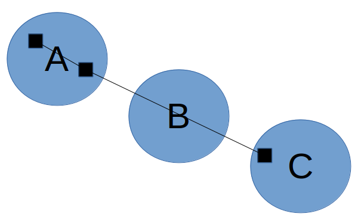
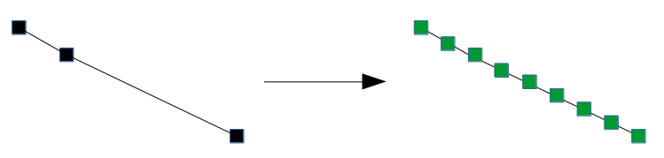
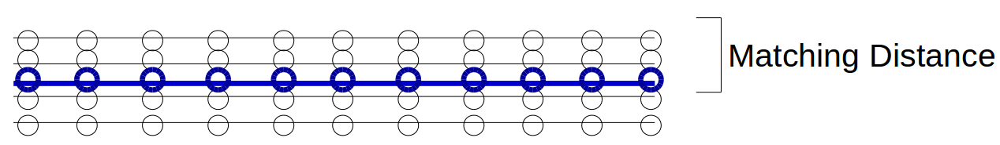

::: {#header_wrap .outer}
::: {#main_content .section .inner}
[6.808](../index.html) {#project_title}
===================

Lab 4: Map Inference from GPS Traces {#project_tagline}
------------------------------------

Assigned: 2021-03-29\
Due: 2021-04-12\
:::
:::

::: {#main_content_wrap .outer}
::: {#main_content .section .inner}
-   [Overview](#overview)
-   [Installation](#installation)
-   [Section 1 --- Implement K-Means-Clustering Map Inference
    Algorithm](#sec1)
-   [Section 2 --- Evaluation](#sec2)
-   [Section 3 --- Topology-Sensitive Evaluation Metric](#sec3)
-   [Submission and Checkoff](#submission)

::: {style="color:#a00"}
:::

Overview
--------

Map inference is a process of automatically producing maps from
collected GPS traces. In this lab, each trace contains multiple
observations, each of which is a 2D location. While a single trace
corresponds to a short drive and each data point is noisy, we can use
multiple traces from the same area to collectively infer the underlying
road network, reducing noise in individual observations. You will
explore two map inference algorithms, k-means clustering and kernel
density estimation, as well as evaluation metrics for map inference.

Specifically, you will

-   Implement a simplified k-means clustering map inference algorithm
-   Compare the performance of the clustering algorithm to that of a
    kernel density estimation algorithm qualitatively, and also using a
    provided geometric evaluation metric
-   Develop a topology-sensitive evaluation metric

The kernel density estimation algorithm is proposed by Biagioni and
Eriksson from UIC: [Map inference in the face of noise and
disparity](https://dl.acm.org/doi/10.1145/2424321.2424333) ([VPN to MIT
network](https://ist.mit.edu/news/vpn_intro) required; [alternate
link](https://www.cs.uic.edu/~jakob/papers/biagioni-gis12.pdf)). You are
welcome to read the paper for more detailed background information. It
might also be helpful to look at the [slides from the 2018 version of
the
class](https://6s062.github.io/6MOB/2018/materials/mapinference.pdf),
which explains both algorithms as well as several evaluation metrics.
The code in this lab is adapted from the code from the paper.

Start by [downloading the Python code for this
lab](codes/lab4/lab4.zip). These files are included:

-   **`infer_kmeans.py`**: you will implement k-means clustering map
    inference algorithm here.
-   **`infer_kmeans_tests.py`**: some unit tests to make sure you
    implemented `infer_kmeans.py` correctly.
-   **`infer_kde.py`**: this is a provided kernel density estimation map
    inference algorithm that you will evaluate in Section 2.
-   **`trace_generator.py`**: a basic simulator to synthetically generate
    GPS traces with a specified level of Gaussian noise.
-   **`eval_geo.py`**: a geometric evaluation metric.
-   **`visualize.py`**: visualize functions for various spatial data.
-   **`util.py`**: various utility functions and classes to load traces,
    represent graphs, etc.
-   **`infer_kde_lib.py`**: utility functions for the KDE algorithm.
-   **`requirements.txt`**: python dependencies to be installed by pip.
-   **`data`** directory:
    -   **`cambridge.xml`**: ground truth data of Cambridge map (XML).
    -   **`cambridge.graph`**: ground truth data of Cambridge map
        (`.graph`).
    -   **`trips_uchicago_meters`**: data from shuttles on the UIC
        campus, for Section 2.
    -   **`section3_graphs`**: simple graphs for Section 3

### Installation {#installation}

This code is tested with Python 3.6 and other python libraries,
including OpenCV 4.2. (Python 2 is not supported.) Follow the
instructions below to use virtualenv and install the required packages.

1.  (Strongly recommended) Install
    [virtualenv](https://virtualenv.pypa.io/en/latest/installation.html)
    and
    [virtualenvwrapper](https://virtualenvwrapper.readthedocs.io/en/latest/install.html).
    (See also: [another
    guide](https://python-guide-cn.readthedocs.io/en/latest/dev/virtualenvs.html).)
    Run the following two lines:

    ```bash
    python -m pip install virtualenv
    python -m pip install virtualenvwrapper
    ```

    Then add the following lines to your shell startup file, e.g.
    `.bashrc`, `.bash_profile` for bash or `.zshrc` for zsh (run `echo
    $0` to see which shell you are using).

    ```bash
    export WORKON_HOME=$HOME/.virtualenvs
    export PROJECT_HOME=$HOME/Devel
    source /usr/local/bin/virtualenvwrapper.sh
    ```

    After editing it, reload the startup file (e.g., run `source
    ~/.bash_profile`) or open a new terminal.

    Note that if you get an error like `
    /usr/local/bin/virtualenvwrapper.sh: No such file or directory`,
    that means your `virtualenvwrapper.sh` is installed somewhere else,
    e.g. with anaconda's python.

    ```bash
    $ which python # python3 if you use python3
    /Users/username/anaconda/bin/python
    $ which virtualenv
    /Users/username/anaconda/bin/virtualenv
    $ ls /Users/username/anaconda/bin/virtualenv*
    # see if there are virtualenvwrapper.sh installed here
    ```

    You need to match the path by adding the following lines to your
    shell startup file instead. 

    ```bash
    export WORKON_HOME=$HOME/.virtualenvs
    export PROJECT_HOME=$HOME/Devel
    source /Users/username/anaconda/bin/virtualenvwrapper.sh
    ```

1.  If you succesfully installed virtualenvwrapper, make a virtualenv
    called `6808` (or a name of your choosing) with python 3.6 or newer.
    (Python 3.7 and 3.8 should also work.)

    ```bash
    mkvirtualenv --python=`which python3.6` 6808
    ```

    You should automatically be in the newly created virtualenv. To
    verify, the outputs of `which python` and `python --version` should
    be similar to this:

    ```bash
    $ which python
    /Users/username/.virtualenvs/6808/bin/python
    $ python --version
    Python 3.6.x
    ```

    If you start a new terminal, you can work in this virtualenv by
    running `workon 6808`. To switch to the default python, run
    `deactivate`.

1.  Download the starter code, uncompress it and `cd` into `lab4`
    directory. From that directory, install required packages within the
    virtualenv.

    ```bash
    pip install -r requirements.txt
    ```

    **Alternatively**, if you do not use virtualenv, you can install
    packages with the gloabl Python interpreter. If your default
    `python` is not Python 3.6 or newer, use `python3.6` to install
    pacakages and run the codes.

    ```bash
    python -m pip install -r requirements.txt
    ```

1.  Test your installation.

    ```bash
    $ python -c "import cv2; print(cv2.__version__)"
    4.2.0
    ```

<!-- 1.  If you recently upgraded your macOS, run: -->

<!--     ```bash -->
<!--      xcode-select --install -->
<!--      ``` -->


Section 1 --- Implement K-Means-Clustering Map Inference Algorithm {#sec1}
------------------------------------------------------------------

You will implement the k-means clustering map inference algorithm. The
algorithm operates in four phases:

-   **Get markers**: drop markers along each trace at fixed intervals
-   **Initialize clusters**: find an initial set of cluster centers
-   **k-means**: run k-means clustering to identify clusters of markers
-   **Generate edges**: process the traces to add edges between clusters

**Get markers.** (This phase is already implemented for you.) The
algorithm starts by extracting markers to use as points for clustering.
Although we could simply use the raw GPS samples/observations as
markers, will not work well if the GPS samples are very far apart:
recall that in the fourth phase, we pass through each trace, and if
successive markers are in different clusters, we connect those clusters;
if the samples are too far apart, then we might end up adding an edge
that bypasses an intermediate cluster:

{width="325px" height="200px"}

Below, we instead add markers at a small fixed distance along the trace.
When we add edges later, it is unlikely that the edges will bypass a
cluster:

{width="600px"}

Each marker will be associated with not only a position, but also a
**bearing**. The bearing indicates which direction the vehicle
associated with the marker is facing, and is measured as an angle in
degrees from the positive x axis. Bearings of the markers (green dots in
the right diagram) are calculated from line segments that connect
consecutive GPS observations (black dots in the left diagram). See the
comments in the code of the `get_markers` function for an example.

**Initialize clusters.** Next, we select a set of initial cluster
centers. k-means clustering will improve these cluster centers in the
next phase, but it is important to have a good initial set of centers or
we will still end up with bad clusters.

To get the initial centers, we will repeatedly randomly sample a marker
from the set of markers that have not yet been assigned to a cluster.
After selecting a marker as a center, any other markers that fall within
a certain distance threshold and bearing threshold to the selected
marker will be assigned to the cluster of the selected marker. We repeat
this process until all markers are assigned to some cluster.

[You should not mutate the `markers` variable in the
`initialize_clusters` method (e.g. you can copy it into another list
first).]{style="color:#a00"}

**k-means clustering.** Now, we run k-means clustering to refine our
clusters. We will take into account both distance and bearing difference
when we perform k-means clustering; you can think of this as if we have
a three-dimensional space, where the distance function used in
clustering takes into account not only the two-dimensional distance, but
also the bearing difference.

Wikipedia has a [good
visualization](https://en.wikipedia.org/wiki/K-means_clustering#Standard_algorithm_(naive_k-means))
of k-means clustering (see \"Demonstration of the standard algorithm\").

**Generate edges.** Finally, we add edges between clusters. We
initialize a road network graph where the center of each cluster is a
vertex (but no edges have been added yet), and then process the traces
one by one. For each trace, we iterate over the markers that we created
for that trace in the first phase. If two successive markers belong to
different clusters, then we connect those clusters. Once we have done
this for all traces, we output the resulting road network graph.

In `infer_kmeans.py`, you should implement the missing functions:

- `initialize_clusters` (this should return a list of `Cluster` objects)
- `kmeans`
- `generate_edges`

As you implement each step, run `infer_kmeans_tests.py` to make sure
your implementation is running correctly. The tests are not exhaustive.
You can qualitatively check the visualization in the next section to see
if the algorithm works as expected.

Section 2 --- Evaluation {#sec2}
------------------------

You will now compare the k-means clustering and kernel density
estimation map inference algorithms on the Cambridge map data,
synthetically generated by `trace_generator.py` in various
configurations in Task 1. (The implementation of the kernel density
estimation map inference algorithm is already provided.) You will also
evaluate the two algorithms on the UIC shuttle dataset (from the
Biagioni and Eriksson paper) in Task 2.

Here is an example command to generate traces for evaluation.

```bash
python trace_generator.py -m data/cambridge.xml -o traces/ -n 100 -g 4 -i 30
```

This will generate 100 random traces where GPS samples are taken 30
meters apart and have 4 meter standard deviation of Gaussian noise. The
traces will be saved in the folder `output`. Each trace will correspond
to a short trip within the road network in the map. With 100 traces, the
data should cover almost the whole map. To see more detailed
explanations of the arguments, run `python trace_generator.py --help`.

You can then run the infer\_kmeans and infer\_kde algorithms. Note that
for 100 traces, `infer_kmeans.py` takes about 15 minutes and
`infer_kde.py` takes about 5 minutes to run. To make sure your
infer\_kmeans algorithm work correctly, you may want to generate a
smaller number of traces (e.g. `-n 5`) and check the result with this
small dataset first, before moving on to the large set.


```bash
python infer_kmeans.py traces output
python infer_kde.py traces output
```

The commands above will generate `output/kmeans-inferred.graph` and
`output/kde-inferred.graph`. The `.graph` files are defined by the
`Graph` class in `util.py` and can be loaded with `Graph.from_file`.

To visualize the graphs, run

```bash
python visualize.py
```

which will by default run the following `visualize_graphs_overlay`
method to visualize an overlay of the actual, K-means, and KDE graphs in
`graphs-overlay.svg`.

```python
def visualize_graphs_overlay(inferred_dir):
    actual_graph = Graph.from_file(os.path.join("data", "cambridge.graph"))
    kmeans_graph = Graph.from_file(os.path.join(inferred_dir, "kmeans-inferred.graph"))
    kde_graph = Graph.from_file(os.path.join(inferred_dir, "kde-inferred.graph"))

    viz = Visualize()
    # color can be a word or svgwrite.rgb(r, g, b) where r, g, b are in range 0 to 255
    viz.draw_graph(actual_graph, color="grey", width=3)
    viz.draw_graph(kmeans_graph, color="red", width=1)
    viz.draw_graph(kde_graph, color="green", width=1)
    viz.save(os.path.join(inferred_dir, "graphs-overlay.svg"))
```

The created svg file can be opened in a web browser. Feel free to modify
`visualize.py` to your visualization needs.

Finally, get the result from the geometric evaluation metric:

```bash
python eval_geo.py data/cambridge.graph output/kmeans-inferred.graph
python eval_geo.py data/cambridge.graph output/kde-inferred.graph
```

This will give you precision, recall, and F1 score. The details of these
metrics will be explained in [Section 3](#sec3).

### Task 1: Analyze Performance with respect to Sparsity and Noise

Using `trace_generator.py`, generate traces with various sparsity --
start with 30 meters, and then try at least four other values while
keeping GPS noise at 4 meters. Pick a reasonably different set of
values.

Run both map inference algorithms and plot precision, recall, and F1
scores based on geometric evaluation as a function of sparsity. (See
Figure 11 on the
[paper](https://www.cs.uic.edu/~jakob/papers/biagioni-gis12.pdf) as an
example.)

Then, do the same with GPS noise -- start with 4 meters, and try at
least four other values while keeping sparsity at 30 meters.

Also use the visualize function in `util.py` to qualitatively compare
the inferred maps. How well does the `eval_geo.py` score correspond to
your qualitative comparison?

### Task 2: Run on UIC Dataset

Run both map inference algorithms on the UIC dataset. Output SVG images
of the generated graphs using `visualize` and qualitatively analyze the
performance differences between the algorithms. (We do not have a ground
truth graph file for this region to use for `eval_geo.py`.)

Section 3 --- Topology-Sensitive Evaluation Metric {#sec3}
--------------------------------------------------

The geometric evaluation metric that we provided is very simple. It
first lays down markers along the ground truth road network and the
inferred road network, with a fixed distance between markers. Then, it
iterates through both sets of markers and tries to match each marker
with another marker in the other set: as long as there is some marker in
the other set that is within a matching distance of the marker, then the
marker is considered successfully matched. Then:

-   $\text{precision} = \dfrac{\text{matched markers for inferred
     network}}{\text{total markers for inferred network}}$
-   $\text{recall} = \dfrac{\text{matched markers for ground truth
     network}}{\text{total markers for ground truth network}}$
-   $\text{F1 score} = \dfrac{2 \cdot \text{precision} \cdot
    \text{recall}}{\text{precision} + \text{recall}}$ (harmonic mean of
    precision and recall)

Note that the metric does not enforce a one-to-one matching. So, for
example, even a road is duplicated several times in the inferred
network, it will still have perfect precision and recall along the
copies of that road as long as they are all within the matching distance
of the actual road:

{width="600px"}

Above, the black lines represent the inferred graph while the blue line
represents the ground truth road. Since the black markers are all within
the matching distance to at least one blue marker, and we are not
enforcing a one-to-one matching, precision and recall are both 1.

This metric has several drawbacks. One major drawback is that it won\'t
penalize for small topological differences (where the positions of roads
are correct but the way that they connect at intersections differs) in
the maps; for example, the ground truth graph might have a four-way
intersection, while the inferred graph might have all four roads stop
before they intersect:


For most purposes of the map (like getting directions from one location
to another), these are actually very significant differences.

Your task in this section is to implement an evaluation metric that
penalizes for these kinds of topological differences. You can implement
one of the metrics described in the [2018
slides](https://6s062.github.io/6MOB/2018/materials/mapinference.pdf)
(TOPO/holes-and-marbles and shortest path in Slides 65-82), or design
and implement your own. Your metric can take into account the
directionality of edges, but it does not have to. Run your metric on the
graphs inferred earlier in Task 1, and create corresponding plots
(include precision/recall plots if your metric uses precision and
recall).

For **holes-and-marbles**, you would randomly pick a vertex in the
ground truth graph, and find the nearest vertex in the other graph.
Then, do a breadth first search from the vertex selected in each graph,
and place markers every 10 meters or so along the edges; stop the search
when you exceed some radius away from the start vertex (e.g., 300
meters). Lastly, match the markers between the graphs and compute
precision and recall. (This evaluation metric is proposed in Section 3
of [this
paper](https://www.cs.uic.edu/~jakob/papers/biagioni-trb12.pdf).)

For **shortest path**, one metric would be to randomly select a pair of
vertices in the ground truth graph, find the nearest vertices in the
other graph, and then compare the distance of the shortest path between
the vertices. Then, repeat this process several times. This metric would
not match the precision/recall framework, but think about how you would
quantitatively compare how good the shortest path distances between each
pair of vertices match, then average those scores together. You may
impose the maximum distance between the source and destination vertices
in the randomization to increase the probability of finding a path.

This section is open-ended, as long as your metric is reasonable. These
are some ideas and your exact implementation can vary. Adjusting
parameters (e.g. marker frequency and match distance for
holes-and-marbles or the maximum distance between the source and
destination vertices for shortest path) will largely affect the final
scores.

We have included two pairs of actual/inferred graphs in the
`data/section3_graphs/` folder for which `eval_geo.py` gives F1 score of
1.0. Your metric should give a non-perfect score for these two pairs.
Visualize these graphs using functions in `visualize.py` to understand
these test graphs.

Submission and Checkoff Instructions {#submission}
-----------------------

Write up your answers to the following items in a single PDF file and
name it **lab4\_kerberos.pdf** or **lab4\_kerberos1+kerberos2.pdf**
(e.g. lab4\_bnagda.pdf or lab4\_bnagda+fadel.pdf). Upload the file to your private channel in Slack by **Apr 12, 11:59 PM**. If you work with a partner, you only have to submit once. You do not need to submit your code, but we may ask to look at your code during the checkoff.

1. Names and MIT emails (including your lab partner, if available).
1. Provide a plot for precision, recall, and F1 scores as a function of
   sparsity based on the geometric evaluation in Section 2.
1. Provide a plot for precision, recall, and F1 scores as a function of
   GPS noise based on the geometric evaluation in Section 2.
1. Provide a visualization that compares the actual, K-means, and KDE
   graphs (like `graphs-overlay.svg` from `visualize.py`) for the
   Cambridge map with the default trace parameters.
1. As a comparison, provide similar visualizations with different trace
   parameters, including at least one generated with different sparsity
   and at least one with different GPS noise.
1. Provide a similar visualization for the UIC dataset. No actual graph
   is not available and does not have to be included.
1. Briefly explain the topology-sensitive evaluation metric that you
   implement in Section 3.
1. Provide a visualization that compares `actual1.graph` and
   `inferred1.graph` in `data/section3_graphs`. Do the same with
   `actual2.graph` and `inferred2.graph`.
1. Based on your evaluation metric, what are the scores of the K-means
   inferred graphs from Section 2? Do the same with the KDE inferred
   graphs. If your metric uses precision and recall, how do they compare
   to the geometric evaluation in Section 2?
1. Based on your evaluation metric, what are the scores of the two
   graphs in Section 3?
1. Estimated number of hours you spent on this lab per person.
1. Any comments/suggestions for the lab? Any questions for the checkoff?
   (Optional)

:::
:::
